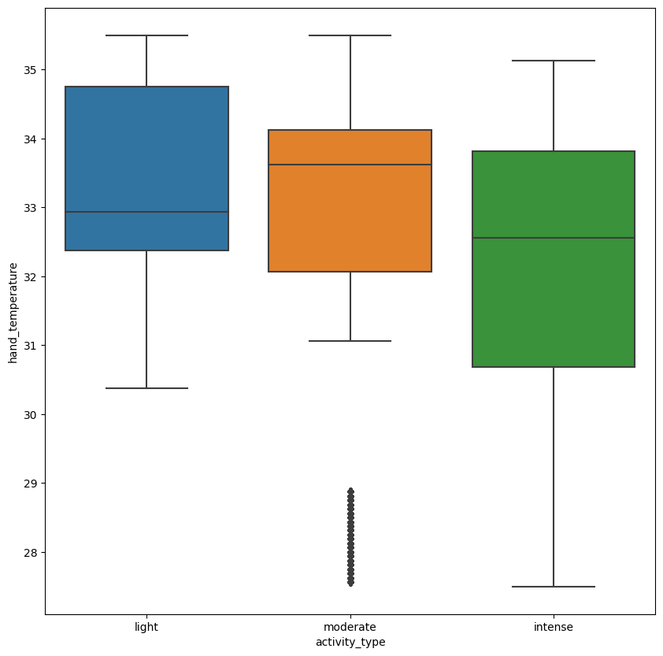

# Data Science Research Methods Report-2

**Note**: Some processed Dataframes have been stored as pickle files which will be loaded later on so the rprocessing code need not be run again and again.

# Extra Libraries to Install

1. Ipython
2. Tabula

## **Introduction**<br>
The PAMAP2 Physical Activity Monitoring dataset (available here) contains data from 9 participants who participated in 18 various physical activities (such as walking, cycling, and soccer) while wearing three inertial measurement units (IMUs) and a heart rate monitor. This information is saved in separate text files for each subject. The goal is to build hardware and/or software that can determine the amount and type of physical activity performed by an individual by using insights derived from analysing the given dataset.


```python
import os
import random
from collections import defaultdict
```


```python
import matplotlib.pyplot as plt
import numpy as np
import pandas as pd
import seaborn as sns
import statsmodels.api as sm
import tabula
from IPython.display import display
from matplotlib import rcParams
from numpy.fft import rfft
from scipy.stats import ranksums, ttest_ind
from sklearn import cluster, preprocessing
from sklearn.cluster import KMeans
from sklearn.decomposition import PCA
from sklearn.linear_model import LogisticRegression
from sklearn.metrics import (accuracy_score, classification_report, f1_score,
                             log_loss, v_measure_score)
```


```python
os.chdir("/home/sahil/Downloads/PAMAP2_Dataset/")  # Setting up working directory
import warnings
```


```python
pd.set_option("max_columns", None) 
pd.set_option("max_rows", None)
```


```python
warnings.filterwarnings("ignore")
```

## Data Cleaning<br>
For tidying up the data :<br>
- The data of various subjects is loaded and given relevant column names<br>
  for various features.<br>
- The data for all subjects are then stacked together to form one table.<br>
- 'Orientation' columns are removed because it was mentioned<br>
  in the data report that it is invalid in this data collection.<br>
- The accelerometer of sensitivity 6g is also removed as it's not completely<br>
  accurate for all activities due to its low sensitivity.<br>
- Similarly, the rows with Activity ID "0" are also removed as<br>
  it does not relate to any specific activity.<br>
- The missing values are filled up using the forward fill method.In this method,<br>
  the blank values are filled with the value occuring just before it.<br>
- Added a new feature, 'BMI' or Body Mass Index for the 'subject_detail' table<br>
- Additional feature, 'Activity Type' is added to the data which classifies activities<br>
  into 3 classes, 'Light' activity,'Moderate' activity and 'Intense' activity.<br>
  1. Lying,sitting,ironing and standing are labelled as 'light' activities.<br>
  2. Vacuum cleaning,descending stairs,normal walking,Nordic walking and cycling are<br>
     considered as 'Moderate' activities<br>
  3. Ascending stairs,running and rope jumping are labelled as 'Intense' activities.<br>
  This classification makes it easier to perform hypothesis testing between pair of attributes.<br>
- Subject 109 is not considered for analysis as it has performed few protocol activities.
- Optional activities are ignored since very few subjects have performed them which makes it difficult to
     model.

Given below are functions to give relevant names to the columns and create a<br>
single table containing data for all subjects


```python
def gen_activity_names():
    # Using this function all the activity names are mapped to their ids
    act_name = {}
    act_name[0] = "transient"
    act_name[1] = "lying"
    act_name[2] = "sitting"
    act_name[3] = "standing"
    act_name[4] = "walking"
    act_name[5] = "running"
    act_name[6] = "cycling"
    act_name[7] = "Nordic_walking"
    act_name[9] = "watching_TV"
    act_name[10] = "computer_work"
    act_name[11] = "car driving"
    act_name[12] = "ascending_stairs"
    act_name[13] = "descending_stairs"
    act_name[16] = "vacuum_cleaning"
    act_name[17] = "ironing"
    act_name[18] = "folding_laundry"
    act_name[19] = "house_cleaning"
    act_name[20] = "playing_soccer"
    act_name[24] = "rope_jumping"
    return act_name
```


```python
def generate_three_IMU(name):
    # Adding coordinate suffix for accelerometer
    x = name + "_x"
    y = name + "_y"
    z = name + "_z"
    return [x, y, z]
```


```python
def generate_four_IMU(name):
    # Adding coordinates suffixes for orientation
    x = name + "_x"
    y = name + "_y"
    z = name + "_z"
    w = name + "_w"
    return [x, y, z, w]
```


```python
def generate_cols_IMU(name):
    # temperature column names
    temp = name + "_temperature"
    output = [temp]
    # acceleration 16g columns names
    acceleration16 = name + "_3D_acceleration_16"
    acceleration16 = generate_three_IMU(acceleration16)
    output.extend(acceleration16)
    # acceleration 6g column anmes
    acceleration6 = name + "_3D_acceleration_6"
    acceleration6 = generate_three_IMU(acceleration6)
    output.extend(acceleration6)
    # gyroscope column names
    gyroscope = name + "_3D_gyroscope"
    gyroscope = generate_three_IMU(gyroscope)
    output.extend(gyroscope)
    # magnometer column names
    magnometer = name + "_3D_magnetometer"
    magnometer = generate_three_IMU(magnometer)
    output.extend(magnometer)
    # oreintation column names
    oreintation = name + "_4D_orientation"
    oreintation = generate_four_IMU(oreintation)
    output.extend(oreintation)
    return output
```


```python
def load_IMU():
    # Function for generating final column names
    output = ["time_stamp", "activity_id", "heart_rate"]
    hand = "hand"
    hand = generate_cols_IMU(hand)
    output.extend(hand)
    chest = "chest"
    chest = generate_cols_IMU(chest)
    output.extend(chest)
    ankle = "ankle"
    ankle = generate_cols_IMU(ankle)
    output.extend(ankle)
    return output
```


```python
def load_subjects(
    root1="/home/sahil/Downloads/PAMAP2_Dataset/Protocol/subject",
    root2="/home/sahil/Downloads/PAMAP2_Dataset/Optional/subject",
):  
    # This function loads data from subject files and names the columns
    cols = load_IMU()
    output = pd.DataFrame()
    for i in range(101, 110):
        path1 = root1 + str(i) + ".dat"
        subject = pd.DataFrame()
        subject_prot = pd.read_table(path1, header=None, sep="\s+")  # subject data from
        # protocol activities
        subject = subject.append(subject_prot)
        subject.columns = cols
        subject = subject.sort_values(
            by="time_stamp"
        )  # Arranging all measurements according to
        # time
        subject["id"] = i
        output = output.append(subject, ignore_index=True)
    return output
```

Feel free to skip the execution of this cell as the output is saved and reloaded in the cells below it.This is done because the eprocessing takes a lot of time and so it was found more appropriate to save the output so re-running the cell is not required


```python
data = load_subjects()  # Add your own location for the data here to replicate the code
# for eg data = load_subjects('filepath')
data = data.drop(
    data[data["activity_id"] == 0].index
)  # Removing rows with activity id of 0
act = gen_activity_names()
data["activity_name"] = data.activity_id.apply(lambda x: act[x])
data = data.drop(
    [i for i in data.columns if "orientation" in i], axis=1
)  # Dropping Orientation  columns
cols_6g = [i for i in data.columns if "_6_" in i]  # 6g acceleration data columns
data = data.drop(cols_6g, axis=1)  # dropping 6g acceleration columns
display(data.head())
# Saving transformed data in pickle format becuse it has the fastest read time compared
# to all other formats
data.to_pickle("activity_data.pkl")  # Saving transformed data for future use
```


```python
def train_test_split_by_subjects(data):  # splitting by subjects
    subjects = [
        i for i in range(101, 109)
    ]  # Eliminate subject 109  due to less activities
    train_subjects = [101, 103, 104, 105]
    test_subjects = [i for i in subjects if i not in train_subjects]
    train = data[data.id.isin(train_subjects)]  # Generating training data
    test = data[data.id.isin(test_subjects)]  # generating testing data
    return train, test
```


```python
def split_by_activities(data):
    light = ["lying", "sitting", "standing", "ironing"]
    moderate = [
        "vacuum_cleaning",
        "descending_stairs",
        "normal_walking",
        "nordic_walking",
        "cycling",
    ]
    intense = ["ascending_stairs", "running", "rope_jumping"]
    def split(activity):  #  method for returning activity labels for activities
        if activity in light:
            return "light"
        elif activity in moderate:
            return "moderate"
        else:
            return "intense"
    data["activity_type"] = data.activity_name.apply(lambda x: split(x))
    return data
```

Loading data and doing the train-test split for EDA and Hypothesis testing.


```python
data = pd.read_pickle("activity_data.pkl")
data = split_by_activities(data)
train, test = train_test_split_by_subjects(
    data
)  # train and test data for EDA and hypothesis testing respectively.
subj_det = tabula.read_pdf(
    "subjectInformation.pdf", pages=1
)  # loading subject detail table from pdf file.
# Eliminating unnecessary columns and fixing the column alignment of the table.
sd = subj_det[0]
new_cols = list(sd.columns)[1:9]
sd = sd[sd.columns[0:8]]
sd.columns = new_cols
subj_det = sd
```

Create clean data for use in modelling


```python
eliminate = [
    "activity_id",
    "activity_name",
    "time_stamp",
    "id",
]  # Columns not meant to be cleaned
features = [i for i in data.columns if i not in eliminate]
clean_data = data
clean_data[features] = clean_data[features].ffill() # Code for forward fill
display(clean_data.head())
```


<div><div id=05dea327-2b5c-4419-b9e4-f7b701a44598 style="display:none; background-color:#9D6CFF; color:white; width:200px; height:30px; padding-left:5px; border-radius:4px; flex-direction:row; justify-content:space-around; align-items:center;" onmouseover="this.style.backgroundColor='#BA9BF8'" onmouseout="this.style.backgroundColor='#9D6CFF'" onclick="window.commands?.execute('create-mitosheet-from-dataframe-output');">See Full Dataframe in Mito</div> <script> if (window.commands.hasCommand('create-mitosheet-from-dataframe-output')) document.getElementById('05dea327-2b5c-4419-b9e4-f7b701a44598').style.display = 'flex' </script> <table border="1" class="dataframe">
  <thead>
    <tr style="text-align: right;">
      <th></th>
      <th>time_stamp</th>
      <th>activity_id</th>
      <th>heart_rate</th>
      <th>hand_temperature</th>
      <th>hand_3D_acceleration_16_x</th>
      <th>hand_3D_acceleration_16_y</th>
      <th>hand_3D_acceleration_16_z</th>
      <th>hand_3D_gyroscope_x</th>
      <th>hand_3D_gyroscope_y</th>
      <th>hand_3D_gyroscope_z</th>
      <th>...</th>
      <th>ankle_3D_acceleration_16_z</th>
      <th>ankle_3D_gyroscope_x</th>
      <th>ankle_3D_gyroscope_y</th>
      <th>ankle_3D_gyroscope_z</th>
      <th>ankle_3D_magnetometer_x</th>
      <th>ankle_3D_magnetometer_y</th>
      <th>ankle_3D_magnetometer_z</th>
      <th>id</th>
      <th>activity_name</th>
      <th>activity_type</th>
    </tr>
  </thead>
  <tbody>
    <tr>
      <th>2928</th>
      <td>37.66</td>
      <td>1</td>
      <td>NaN</td>
      <td>30.375</td>
      <td>2.21530</td>
      <td>8.27915</td>
      <td>5.58753</td>
      <td>-0.004750</td>
      <td>0.037579</td>
      <td>-0.011145</td>
      <td>...</td>
      <td>0.095156</td>
      <td>0.002908</td>
      <td>-0.027714</td>
      <td>0.001752</td>
      <td>-61.1081</td>
      <td>-36.8636</td>
      <td>-58.3696</td>
      <td>101</td>
      <td>lying</td>
      <td>light</td>
    </tr>
    <tr>
      <th>2929</th>
      <td>37.67</td>
      <td>1</td>
      <td>NaN</td>
      <td>30.375</td>
      <td>2.29196</td>
      <td>7.67288</td>
      <td>5.74467</td>
      <td>-0.171710</td>
      <td>0.025479</td>
      <td>-0.009538</td>
      <td>...</td>
      <td>-0.020804</td>
      <td>0.020882</td>
      <td>0.000945</td>
      <td>0.006007</td>
      <td>-60.8916</td>
      <td>-36.3197</td>
      <td>-58.3656</td>
      <td>101</td>
      <td>lying</td>
      <td>light</td>
    </tr>
    <tr>
      <th>2930</th>
      <td>37.68</td>
      <td>1</td>
      <td>NaN</td>
      <td>30.375</td>
      <td>2.29090</td>
      <td>7.14240</td>
      <td>5.82342</td>
      <td>-0.238241</td>
      <td>0.011214</td>
      <td>0.000831</td>
      <td>...</td>
      <td>-0.059173</td>
      <td>-0.035392</td>
      <td>-0.052422</td>
      <td>-0.004882</td>
      <td>-60.3407</td>
      <td>-35.7842</td>
      <td>-58.6119</td>
      <td>101</td>
      <td>lying</td>
      <td>light</td>
    </tr>
    <tr>
      <th>2931</th>
      <td>37.69</td>
      <td>1</td>
      <td>NaN</td>
      <td>30.375</td>
      <td>2.21800</td>
      <td>7.14365</td>
      <td>5.89930</td>
      <td>-0.192912</td>
      <td>0.019053</td>
      <td>0.013374</td>
      <td>...</td>
      <td>0.094385</td>
      <td>-0.032514</td>
      <td>-0.018844</td>
      <td>0.026950</td>
      <td>-60.7646</td>
      <td>-37.1028</td>
      <td>-57.8799</td>
      <td>101</td>
      <td>lying</td>
      <td>light</td>
    </tr>
    <tr>
      <th>2932</th>
      <td>37.70</td>
      <td>1</td>
      <td>100.0</td>
      <td>30.375</td>
      <td>2.30106</td>
      <td>7.25857</td>
      <td>6.09259</td>
      <td>-0.069961</td>
      <td>-0.018328</td>
      <td>0.004582</td>
      <td>...</td>
      <td>0.095775</td>
      <td>0.001351</td>
      <td>-0.048878</td>
      <td>-0.006328</td>
      <td>-60.2040</td>
      <td>-37.1225</td>
      <td>-57.8847</td>
      <td>101</td>
      <td>lying</td>
      <td>light</td>
    </tr>
  </tbody>
</table></div>


After using the Forward Fill method, the first four values of heart rate are still missing. So the first four rows are dropped


```python
clean_data = clean_data.dropna()
display(clean_data.head())
```


<div><div id=5dc29165-c5e8-4407-9cdd-e873178f359e style="display:none; background-color:#9D6CFF; color:white; width:200px; height:30px; padding-left:5px; border-radius:4px; flex-direction:row; justify-content:space-around; align-items:center;" onmouseover="this.style.backgroundColor='#BA9BF8'" onmouseout="this.style.backgroundColor='#9D6CFF'" onclick="window.commands?.execute('create-mitosheet-from-dataframe-output');">See Full Dataframe in Mito</div> <script> if (window.commands.hasCommand('create-mitosheet-from-dataframe-output')) document.getElementById('5dc29165-c5e8-4407-9cdd-e873178f359e').style.display = 'flex' </script> <table border="1" class="dataframe">
  <thead>
    <tr style="text-align: right;">
      <th></th>
      <th>time_stamp</th>
      <th>activity_id</th>
      <th>heart_rate</th>
      <th>hand_temperature</th>
      <th>hand_3D_acceleration_16_x</th>
      <th>hand_3D_acceleration_16_y</th>
      <th>hand_3D_acceleration_16_z</th>
      <th>hand_3D_gyroscope_x</th>
      <th>hand_3D_gyroscope_y</th>
      <th>hand_3D_gyroscope_z</th>
      <th>...</th>
      <th>ankle_3D_acceleration_16_z</th>
      <th>ankle_3D_gyroscope_x</th>
      <th>ankle_3D_gyroscope_y</th>
      <th>ankle_3D_gyroscope_z</th>
      <th>ankle_3D_magnetometer_x</th>
      <th>ankle_3D_magnetometer_y</th>
      <th>ankle_3D_magnetometer_z</th>
      <th>id</th>
      <th>activity_name</th>
      <th>activity_type</th>
    </tr>
  </thead>
  <tbody>
    <tr>
      <th>2932</th>
      <td>37.70</td>
      <td>1</td>
      <td>100.0</td>
      <td>30.375</td>
      <td>2.30106</td>
      <td>7.25857</td>
      <td>6.09259</td>
      <td>-0.069961</td>
      <td>-0.018328</td>
      <td>0.004582</td>
      <td>...</td>
      <td>0.095775</td>
      <td>0.001351</td>
      <td>-0.048878</td>
      <td>-0.006328</td>
      <td>-60.2040</td>
      <td>-37.1225</td>
      <td>-57.8847</td>
      <td>101</td>
      <td>lying</td>
      <td>light</td>
    </tr>
    <tr>
      <th>2933</th>
      <td>37.71</td>
      <td>1</td>
      <td>100.0</td>
      <td>30.375</td>
      <td>2.07165</td>
      <td>7.25965</td>
      <td>6.01218</td>
      <td>0.063895</td>
      <td>0.007175</td>
      <td>0.024701</td>
      <td>...</td>
      <td>-0.098161</td>
      <td>0.003793</td>
      <td>-0.026906</td>
      <td>0.004125</td>
      <td>-61.3257</td>
      <td>-36.9744</td>
      <td>-57.7501</td>
      <td>101</td>
      <td>lying</td>
      <td>light</td>
    </tr>
    <tr>
      <th>2934</th>
      <td>37.72</td>
      <td>1</td>
      <td>100.0</td>
      <td>30.375</td>
      <td>2.41148</td>
      <td>7.59780</td>
      <td>5.93915</td>
      <td>0.190837</td>
      <td>0.003116</td>
      <td>0.038762</td>
      <td>...</td>
      <td>-0.098862</td>
      <td>0.036814</td>
      <td>-0.032277</td>
      <td>-0.006866</td>
      <td>-61.5520</td>
      <td>-36.9632</td>
      <td>-57.9957</td>
      <td>101</td>
      <td>lying</td>
      <td>light</td>
    </tr>
    <tr>
      <th>2935</th>
      <td>37.73</td>
      <td>1</td>
      <td>100.0</td>
      <td>30.375</td>
      <td>2.32815</td>
      <td>7.63431</td>
      <td>5.70686</td>
      <td>0.200328</td>
      <td>-0.009266</td>
      <td>0.068567</td>
      <td>...</td>
      <td>-0.136998</td>
      <td>-0.010352</td>
      <td>-0.016621</td>
      <td>0.006548</td>
      <td>-61.5738</td>
      <td>-36.1724</td>
      <td>-59.3487</td>
      <td>101</td>
      <td>lying</td>
      <td>light</td>
    </tr>
    <tr>
      <th>2936</th>
      <td>37.74</td>
      <td>1</td>
      <td>100.0</td>
      <td>30.375</td>
      <td>2.25096</td>
      <td>7.78598</td>
      <td>5.62821</td>
      <td>0.204098</td>
      <td>-0.068256</td>
      <td>0.050000</td>
      <td>...</td>
      <td>0.133911</td>
      <td>0.039346</td>
      <td>0.020393</td>
      <td>-0.011880</td>
      <td>-61.7741</td>
      <td>-37.1744</td>
      <td>-58.1199</td>
      <td>101</td>
      <td>lying</td>
      <td>light</td>
    </tr>
  </tbody>
</table></div>


Finally, save the clean data for future use in model prediction


```python
clean_data.to_pickle("clean_act_data.pkl")
```

## Exploratory Data Analysis<br>
After labelling the data appropriately, 4 subjects are selected for training set.Subjects 101, 103, 104, 105 are selected for training set adn rest for training set. 4 subjects for testing set such that the training and testing set have approximately equal size.
In the training set, we perform Exploratory Data Analysis and come up with potential hypotheses.<br>
We then test those hypotheses on the testing set.<br>
50% of data is used for training in this case(Exploratory data analysis) and the rest for testing.

Calculating BMI of the subjects


```python
height_in_metres = subj_det["Height (cm)"] / 100 # Calculating Height in metres
weight_in_kg = subj_det["Weight (kg)"]
subj_det["BMI"] = weight_in_kg / (height_in_metres) ** 2 
```

### Data Visualizations

* Bar chart for frequency of activities.


```python
rcParams["figure.figsize"] = 40, 25 # setting the figure dimensions
rcParams["font.size"] =  25 # Setting font size

ax = sns.countplot(x="activity_name", data=train)
ax.set_xticklabels(ax.get_xticklabels(), rotation=45)  # Rotating Text
plt.show()
```


* 3D scatter plot of chest acceleration coordinates for lying<br>
<br>
  It is expected that vertical chest acceleration will be more while lying due to the<br>
  movements involved and an attempt is made to check this visually over here.


```python
plt.clf()
rcParams["font.size"] =  15

train_running = train[train.activity_name == "lying"] # Extracting rows with activity labelled as lying
fig = plt.figure()
ax = fig.add_subplot(projection="3d")
x = train_running["chest_3D_acceleration_16_x"]
y = train_running["chest_3D_acceleration_16_y"]
z = train_running["chest_3D_acceleration_16_z"]
ax.scatter(x, y, z)
ax.set_xlabel("X Axis")
ax.set_ylabel("Y Axis")
ax.set_zlabel("Z Axis")
plt.show()
```


    <Figure size 4000x2500 with 0 Axes>


   As we see, there seems to be more variance along the z axis(vertical direction) than the<br>
   x and y axis.

* 3D scatter plot of chest acceleration coordinates for running<br>
<br>
  Since running involves mostly horizontal movements for the chest, we expect<br>
  most of chest acceleration data to lie on the horizontal x amd y axis.


```python
plt.clf()
train_running = train[train.activity_name == "running"] # Extracting rows  with activity labeleed as running
fig = plt.figure()
ax = fig.add_subplot(projection="3d")
x = train_running["chest_3D_acceleration_16_x"]
y = train_running["chest_3D_acceleration_16_y"]
z = train_running["chest_3D_acceleration_16_z"]
ax.scatter(x, y, z)
ax.set_xlabel("X Axis")
ax.set_ylabel("Y Axis")
ax.set_zlabel("Z Axis")
plt.show()
```


    <Figure size 4000x2500 with 0 Axes>


  As we expected, for running, most of the points lie along the x and y axis.

* Time series plot of z axis chest acceleration

Subject 101 is considered for this time series plot as it does all protocol activities


```python
plt.clf()
rcParams["font.size"] =  25

random.seed(4)
train1 = train[train.id == 101]
sns.lineplot(
    x="time_stamp", y="chest_3D_acceleration_16_z", hue="activity_name", data=train1
) # Generating timeplot and grouping it with activity name
plt.show()
```


It look like the vertical chest acceleration during lying is higher compared to other activities.Also there seems to be a lot of variance for this feature while the subject is running.

* Time series plot of x axis chest acceleration


```python
plt.clf()
random.seed(4)
train1 = train[train.id == 101]
sns.lineplot(
    x="time_stamp", y="chest_3D_acceleration_16_x", hue="activity_name", data=train1
)
plt.show()
```


As expected the variance is higher for activities that require horizontal movement through space

* Boxplot of heart rate grouped by activity type.


```python
rcParams["figure.figsize"] = 10, 10
rcParams["font.size"] =  10

ax = sns.boxplot(x="activity_type", y="heart_rate", data=train)
ax.set_xticklabels(ax.get_xticklabels(), rotation=0)  # Rotating Text
plt.show()
```


 1. It is observed that moderate and intense activities have higher heart rate than<br>
    light activities as expected.<br>
 2. There doesn't seem to be much seperation between heart rate of  moderate and intesne<br>
    activity.

* Boxplot of heart rate grouped by activity.


```python
rcParams["figure.figsize"] = 40, 25
ax = sns.boxplot(x="activity_name", y="heart_rate", data=train)
ax.set_xticklabels(ax.get_xticklabels(), rotation=45)  # Rotating Text
plt.show()
```


  1.  Most of the activities have a skewed distribution for heart rate.<br>
  2. 'Nordic_walking','running' and 'cycling' have a lot of outliers on the lower side.<br>
  3.  Activities like 'lying','sitting' and 'standing' have a lot of outliers on the upper side.

* Boxplot of hand temperature grouped by activity type.


```python
rcParams["figure.figsize"] = 10, 10
rcParams["font.size"] =  10

ax = sns.boxplot(x="activity_type", y="hand_temperature", data=train)
ax.set_xticklabels(ax.get_xticklabels(), rotation=0)
plt.show()
```





1. Hand temperature of moderate activitie have a lot of outliers on the lower side.<br>
2. There doesn't seem to be much difference in temperatures between activities.

* Boxplot of hand temperature grouped by activity.


```python
rcParams["figure.figsize"] = 40, 25
rcParams["font.size"] =  22

ax = sns.boxplot(x="activity_name", y="hand_temperature", data=train)
ax.set_xticklabels(ax.get_xticklabels(), rotation=45)  # Rotating Text
plt.show()
```


* Boxplot of ankle temperature grouped by activity_type


```python
rcParams["figure.figsize"] = 15, 10
rcParams["font.size"] =  20

ax = sns.boxplot(x="activity_type", y="ankle_temperature", data=train)
ax.set_xticklabels(ax.get_xticklabels(), rotation=0)
plt.show()
```


1. Ankle temperature of light and moderate activitie have  outliers on the lower side.<br>
2. There doesn't seem to be much difference in temperatures between activities.

* Boxplot of ankle temperature grouped by activity


```python
rcParams["figure.figsize"] = 40, 25
rcParams["font.size"] =  25

ax = sns.boxplot(x="activity_name", y="ankle_temperature", data=train)
ax.set_xticklabels(ax.get_xticklabels(), rotation=45)  # Rotating Text
plt.show()
```


1. Outliers are mostly present in 'vacuum_cleaning' on the lower side.

* Boxplot of chest temperature grouped by activity_type


```python
rcParams["figure.figsize"] = 15, 10
rcParams["font.size"] =  15

ax = sns.boxplot(x="activity_type", y="chest_temperature", data=train)
ax.set_xticklabels(ax.get_xticklabels(), rotation=0)
plt.show()
```


1. For chest temperatures, only the 'intense' activity type has one outlier.<br>
2. For this feature as well, there doesn't seem to be much difference between<br>
   temperatures.

* Boxplot of chest temperature grouped by activity.


```python
rcParams["figure.figsize"] = 40, 25
rcParams["font.size"] =  25

ax = sns.boxplot(x="activity_name", y="chest_temperature", data=train)
ax.set_xticklabels(ax.get_xticklabels(), rotation=45)  # Rotating Text
plt.show()
```


1. Most of the activities seem to have a skewed distribution for chest temperature.<br>


* Correlation map for relevant features


```python
discard = [
    "activity_id",
    "activity",
    "time_stamp",
    "id",
]  # Columns to exclude from correlation map and descriptive statistics
train_trimmed = train[set(train.columns).difference(set(discard))]
```


```python
rcParams["figure.figsize"] = 20, 20 # Setting figure dimension
sns.heatmap(train_trimmed.corr(), cmap="BrBG") # Setting colorsheme and giving correlation matrix as input
plt.show()
```


There seems to be a lot of significant correlations between many features 

### Descriptive Statistics<br>
Subject Details


```python
display(subj_det)
```


<div><div id=dee8040e-db8c-4261-9d9b-77ccd52212b5 style="display:none; background-color:#9D6CFF; color:white; width:200px; height:30px; padding-left:5px; border-radius:4px; flex-direction:row; justify-content:space-around; align-items:center;" onmouseover="this.style.backgroundColor='#BA9BF8'" onmouseout="this.style.backgroundColor='#9D6CFF'" onclick="window.commands?.execute('create-mitosheet-from-dataframe-output');">See Full Dataframe in Mito</div> <script> if (window.commands.hasCommand('create-mitosheet-from-dataframe-output')) document.getElementById('dee8040e-db8c-4261-9d9b-77ccd52212b5').style.display = 'flex' </script> <table border="1" class="dataframe">
  <thead>
    <tr style="text-align: right;">
      <th></th>
      <th>Subject ID</th>
      <th>Sex</th>
      <th>Age (years)</th>
      <th>Height (cm)</th>
      <th>Weight (kg)</th>
      <th>Resting HR (bpm)</th>
      <th>Max HR (bpm)</th>
      <th>Dominant hand</th>
      <th>BMI</th>
    </tr>
  </thead>
  <tbody>
    <tr>
      <th>0</th>
      <td>101</td>
      <td>Male</td>
      <td>27</td>
      <td>182</td>
      <td>83</td>
      <td>75</td>
      <td>193</td>
      <td>right</td>
      <td>25.057360</td>
    </tr>
    <tr>
      <th>1</th>
      <td>102</td>
      <td>Female</td>
      <td>25</td>
      <td>169</td>
      <td>78</td>
      <td>74</td>
      <td>195</td>
      <td>right</td>
      <td>27.309968</td>
    </tr>
    <tr>
      <th>2</th>
      <td>103</td>
      <td>Male</td>
      <td>31</td>
      <td>187</td>
      <td>92</td>
      <td>68</td>
      <td>189</td>
      <td>right</td>
      <td>26.309017</td>
    </tr>
    <tr>
      <th>3</th>
      <td>104</td>
      <td>Male</td>
      <td>24</td>
      <td>194</td>
      <td>95</td>
      <td>58</td>
      <td>196</td>
      <td>right</td>
      <td>25.241790</td>
    </tr>
    <tr>
      <th>4</th>
      <td>105</td>
      <td>Male</td>
      <td>26</td>
      <td>180</td>
      <td>73</td>
      <td>70</td>
      <td>194</td>
      <td>right</td>
      <td>22.530864</td>
    </tr>
    <tr>
      <th>5</th>
      <td>106</td>
      <td>Male</td>
      <td>26</td>
      <td>183</td>
      <td>69</td>
      <td>60</td>
      <td>194</td>
      <td>right</td>
      <td>20.603780</td>
    </tr>
    <tr>
      <th>6</th>
      <td>107</td>
      <td>Male</td>
      <td>23</td>
      <td>173</td>
      <td>86</td>
      <td>60</td>
      <td>197</td>
      <td>right</td>
      <td>28.734672</td>
    </tr>
    <tr>
      <th>7</th>
      <td>108</td>
      <td>Male</td>
      <td>32</td>
      <td>179</td>
      <td>87</td>
      <td>66</td>
      <td>188</td>
      <td>left</td>
      <td>27.152711</td>
    </tr>
    <tr>
      <th>8</th>
      <td>109</td>
      <td>Male</td>
      <td>31</td>
      <td>168</td>
      <td>65</td>
      <td>54</td>
      <td>189</td>
      <td>right</td>
      <td>23.030045</td>
    </tr>
  </tbody>
</table></div>


Mean of heart rate and temperatures for each activity


```python
display(
    train.groupby(by="activity_name")[
        ["heart_rate", "chest_temperature", "hand_temperature", "ankle_temperature"]
    ].mean()
) 
```


<div><div id=5703f685-3835-4864-8d12-0e78a07bcc89 style="display:none; background-color:#9D6CFF; color:white; width:200px; height:30px; padding-left:5px; border-radius:4px; flex-direction:row; justify-content:space-around; align-items:center;" onmouseover="this.style.backgroundColor='#BA9BF8'" onmouseout="this.style.backgroundColor='#9D6CFF'" onclick="window.commands?.execute('create-mitosheet-from-dataframe-output');">See Full Dataframe in Mito</div> <script> if (window.commands.hasCommand('create-mitosheet-from-dataframe-output')) document.getElementById('5703f685-3835-4864-8d12-0e78a07bcc89').style.display = 'flex' </script> <table border="1" class="dataframe">
  <thead>
    <tr style="text-align: right;">
      <th></th>
      <th>heart_rate</th>
      <th>chest_temperature</th>
      <th>hand_temperature</th>
      <th>ankle_temperature</th>
    </tr>
    <tr>
      <th>activity_name</th>
      <th></th>
      <th></th>
      <th></th>
      <th></th>
    </tr>
  </thead>
  <tbody>
    <tr>
      <th>Nordic_walking</th>
      <td>128.934574</td>
      <td>36.640204</td>
      <td>32.124192</td>
      <td>33.778505</td>
    </tr>
    <tr>
      <th>ascending_stairs</th>
      <td>132.404398</td>
      <td>36.586821</td>
      <td>33.381660</td>
      <td>34.146043</td>
    </tr>
    <tr>
      <th>cycling</th>
      <td>127.117356</td>
      <td>35.894279</td>
      <td>31.493273</td>
      <td>33.617997</td>
    </tr>
    <tr>
      <th>descending_stairs</th>
      <td>130.733971</td>
      <td>36.701044</td>
      <td>33.195439</td>
      <td>34.147815</td>
    </tr>
    <tr>
      <th>ironing</th>
      <td>94.586717</td>
      <td>36.162343</td>
      <td>33.845229</td>
      <td>34.103435</td>
    </tr>
    <tr>
      <th>...</th>
      <td>...</td>
      <td>...</td>
      <td>...</td>
      <td>...</td>
    </tr>
    <tr>
      <th>running</th>
      <td>158.613734</td>
      <td>35.262980</td>
      <td>32.372712</td>
      <td>33.646088</td>
    </tr>
    <tr>
      <th>sitting</th>
      <td>82.242313</td>
      <td>35.238913</td>
      <td>33.025149</td>
      <td>33.370173</td>
    </tr>
    <tr>
      <th>standing</th>
      <td>95.112994</td>
      <td>35.590371</td>
      <td>33.445441</td>
      <td>33.742018</td>
    </tr>
    <tr>
      <th>vacuum_cleaning</th>
      <td>107.774620</td>
      <td>36.530023</td>
      <td>34.006465</td>
      <td>34.358195</td>
    </tr>
    <tr>
      <th>walking</th>
      <td>115.147733</td>
      <td>36.964260</td>
      <td>32.232594</td>
      <td>34.152572</td>
    </tr>
  </tbody>
</table></div>


Descriptive info of relevant features


```python
display(train_trimmed.describe())
```


<div><div id=966dba39-86e4-4b4f-b482-85dcd8a65321 style="display:none; background-color:#9D6CFF; color:white; width:200px; height:30px; padding-left:5px; border-radius:4px; flex-direction:row; justify-content:space-around; align-items:center;" onmouseover="this.style.backgroundColor='#BA9BF8'" onmouseout="this.style.backgroundColor='#9D6CFF'" onclick="window.commands?.execute('create-mitosheet-from-dataframe-output');">See Full Dataframe in Mito</div> <script> if (window.commands.hasCommand('create-mitosheet-from-dataframe-output')) document.getElementById('966dba39-86e4-4b4f-b482-85dcd8a65321').style.display = 'flex' </script> <table border="1" class="dataframe">
  <thead>
    <tr style="text-align: right;">
      <th></th>
      <th>chest_temperature</th>
      <th>hand_3D_magnetometer_x</th>
      <th>heart_rate</th>
      <th>ankle_temperature</th>
      <th>chest_3D_acceleration_16_x</th>
      <th>hand_3D_gyroscope_x</th>
      <th>chest_3D_magnetometer_z</th>
      <th>chest_3D_gyroscope_y</th>
      <th>hand_3D_magnetometer_z</th>
      <th>ankle_3D_gyroscope_y</th>
      <th>...</th>
      <th>chest_3D_acceleration_16_y</th>
      <th>hand_3D_gyroscope_z</th>
      <th>chest_3D_magnetometer_x</th>
      <th>chest_3D_gyroscope_z</th>
      <th>ankle_3D_gyroscope_x</th>
      <th>ankle_3D_magnetometer_y</th>
      <th>ankle_3D_magnetometer_z</th>
      <th>chest_3D_acceleration_16_z</th>
      <th>ankle_3D_magnetometer_x</th>
      <th>hand_3D_acceleration_16_z</th>
    </tr>
  </thead>
  <tbody>
    <tr>
      <th>count</th>
      <td>927296.000000</td>
      <td>922733.000000</td>
      <td>84798.000000</td>
      <td>924261.000000</td>
      <td>927296.000000</td>
      <td>922733.000000</td>
      <td>927296.000000</td>
      <td>927296.000000</td>
      <td>922733.000000</td>
      <td>924261.000000</td>
      <td>...</td>
      <td>927296.000000</td>
      <td>922733.000000</td>
      <td>927296.000000</td>
      <td>927296.000000</td>
      <td>924261.000000</td>
      <td>924261.000000</td>
      <td>924261.000000</td>
      <td>927296.000000</td>
      <td>924261.000000</td>
      <td>922733.000000</td>
    </tr>
    <tr>
      <th>mean</th>
      <td>35.961841</td>
      <td>20.935601</td>
      <td>109.912769</td>
      <td>33.776342</td>
      <td>0.240625</td>
      <td>0.012205</td>
      <td>3.616971</td>
      <td>0.009578</td>
      <td>-25.306925</td>
      <td>-0.029152</td>
      <td>...</td>
      <td>8.137126</td>
      <td>-0.000027</td>
      <td>4.634805</td>
      <td>-0.025351</td>
      <td>0.007019</td>
      <td>-0.243321</td>
      <td>16.765524</td>
      <td>-1.164960</td>
      <td>-34.292921</td>
      <td>3.819557</td>
    </tr>
    <tr>
      <th>std</th>
      <td>1.398668</td>
      <td>25.717188</td>
      <td>26.029426</td>
      <td>0.761948</td>
      <td>1.736878</td>
      <td>1.251699</td>
      <td>23.695410</td>
      <td>0.549806</td>
      <td>22.172517</td>
      <td>0.571440</td>
      <td>...</td>
      <td>4.867817</td>
      <td>1.550689</td>
      <td>18.799139</td>
      <td>0.288043</td>
      <td>1.022017</td>
      <td>23.717646</td>
      <td>21.612666</td>
      <td>4.721856</td>
      <td>21.381194</td>
      <td>3.675067</td>
    </tr>
    <tr>
      <th>min</th>
      <td>32.187500</td>
      <td>-103.941000</td>
      <td>57.000000</td>
      <td>30.750000</td>
      <td>-39.203400</td>
      <td>-27.804400</td>
      <td>-66.684700</td>
      <td>-4.672250</td>
      <td>-164.937000</td>
      <td>-7.807450</td>
      <td>...</td>
      <td>-25.955900</td>
      <td>-14.264700</td>
      <td>-70.062700</td>
      <td>-2.642760</td>
      <td>-13.385600</td>
      <td>-137.908000</td>
      <td>-102.716000</td>
      <td>-53.401900</td>
      <td>-172.865000</td>
      <td>-38.907800</td>
    </tr>
    <tr>
      <th>25%</th>
      <td>35.062500</td>
      <td>2.499940</td>
      <td>89.000000</td>
      <td>33.375000</td>
      <td>-0.580049</td>
      <td>-0.387488</td>
      <td>-11.103325</td>
      <td>-0.135082</td>
      <td>-40.472500</td>
      <td>-0.130252</td>
      <td>...</td>
      <td>5.901193</td>
      <td>-0.354068</td>
      <td>-6.381310</td>
      <td>-0.127878</td>
      <td>-0.201214</td>
      <td>-15.123500</td>
      <td>2.088300</td>
      <td>-3.827573</td>
      <td>-45.705600</td>
      <td>1.721670</td>
    </tr>
    <tr>
      <th>50%</th>
      <td>36.000000</td>
      <td>22.012300</td>
      <td>109.000000</td>
      <td>34.000000</td>
      <td>0.355426</td>
      <td>-0.005547</td>
      <td>1.054870</td>
      <td>-0.000901</td>
      <td>-24.964300</td>
      <td>-0.006023</td>
      <td>...</td>
      <td>9.265210</td>
      <td>-0.004496</td>
      <td>3.193960</td>
      <td>-0.016610</td>
      <td>0.003077</td>
      <td>-0.349413</td>
      <td>20.468600</td>
      <td>-1.233810</td>
      <td>-35.768600</td>
      <td>3.721100</td>
    </tr>
    <tr>
      <th>75%</th>
      <td>37.000000</td>
      <td>40.078900</td>
      <td>127.000000</td>
      <td>34.312500</td>
      <td>1.035780</td>
      <td>0.338614</td>
      <td>20.523525</td>
      <td>0.162768</td>
      <td>-10.695900</td>
      <td>0.085158</td>
      <td>...</td>
      <td>9.768020</td>
      <td>0.393650</td>
      <td>14.399500</td>
      <td>0.077227</td>
      <td>0.095482</td>
      <td>17.762500</td>
      <td>30.407100</td>
      <td>0.835319</td>
      <td>-17.365300</td>
      <td>6.407160</td>
    </tr>
    <tr>
      <th>max</th>
      <td>38.562500</td>
      <td>133.830000</td>
      <td>183.000000</td>
      <td>35.000000</td>
      <td>27.522300</td>
      <td>26.415800</td>
      <td>96.358500</td>
      <td>4.540310</td>
      <td>101.758000</td>
      <td>6.410380</td>
      <td>...</td>
      <td>107.825000</td>
      <td>14.338400</td>
      <td>80.473900</td>
      <td>2.716240</td>
      <td>13.142500</td>
      <td>94.247800</td>
      <td>122.521000</td>
      <td>17.878100</td>
      <td>91.551600</td>
      <td>76.639600</td>
    </tr>
  </tbody>
</table></div>


Variance of each axis of acceleration grouped by activities
It is expected that variance along x,y and z axis for acceleration will be different for different activities.An attempt is made to investigate this.


```python
coordinates = [i for i in train.columns if "acceleration" in i]
display(train.groupby(by="activity_name")[coordinates].var())
```


<div><div id=41a04640-8ea2-4236-9567-0ce68d936ad2 style="display:none; background-color:#9D6CFF; color:white; width:200px; height:30px; padding-left:5px; border-radius:4px; flex-direction:row; justify-content:space-around; align-items:center;" onmouseover="this.style.backgroundColor='#BA9BF8'" onmouseout="this.style.backgroundColor='#9D6CFF'" onclick="window.commands?.execute('create-mitosheet-from-dataframe-output');">See Full Dataframe in Mito</div> <script> if (window.commands.hasCommand('create-mitosheet-from-dataframe-output')) document.getElementById('41a04640-8ea2-4236-9567-0ce68d936ad2').style.display = 'flex' </script> <table border="1" class="dataframe">
  <thead>
    <tr style="text-align: right;">
      <th></th>
      <th>hand_3D_acceleration_16_x</th>
      <th>hand_3D_acceleration_16_y</th>
      <th>hand_3D_acceleration_16_z</th>
      <th>chest_3D_acceleration_16_x</th>
      <th>chest_3D_acceleration_16_y</th>
      <th>chest_3D_acceleration_16_z</th>
      <th>ankle_3D_acceleration_16_x</th>
      <th>ankle_3D_acceleration_16_y</th>
      <th>ankle_3D_acceleration_16_z</th>
    </tr>
    <tr>
      <th>activity_name</th>
      <th></th>
      <th></th>
      <th></th>
      <th></th>
      <th></th>
      <th></th>
      <th></th>
      <th></th>
      <th></th>
    </tr>
  </thead>
  <tbody>
    <tr>
      <th>Nordic_walking</th>
      <td>25.629540</td>
      <td>58.398422</td>
      <td>10.603472</td>
      <td>2.575901</td>
      <td>15.242082</td>
      <td>6.148342</td>
      <td>33.484057</td>
      <td>92.289911</td>
      <td>15.376649</td>
    </tr>
    <tr>
      <th>ascending_stairs</th>
      <td>23.543054</td>
      <td>7.566316</td>
      <td>5.824274</td>
      <td>2.765901</td>
      <td>10.775441</td>
      <td>5.624425</td>
      <td>42.033634</td>
      <td>55.288195</td>
      <td>28.013199</td>
    </tr>
    <tr>
      <th>cycling</th>
      <td>17.791446</td>
      <td>15.649830</td>
      <td>9.939227</td>
      <td>0.715780</td>
      <td>3.711593</td>
      <td>4.622890</td>
      <td>17.858721</td>
      <td>12.164733</td>
      <td>3.018095</td>
    </tr>
    <tr>
      <th>descending_stairs</th>
      <td>24.243241</td>
      <td>11.550501</td>
      <td>12.489337</td>
      <td>2.984501</td>
      <td>21.431527</td>
      <td>4.440417</td>
      <td>47.242317</td>
      <td>70.014202</td>
      <td>25.787439</td>
    </tr>
    <tr>
      <th>ironing</th>
      <td>10.310193</td>
      <td>10.363109</td>
      <td>13.358504</td>
      <td>2.033213</td>
      <td>0.736907</td>
      <td>4.374898</td>
      <td>0.174704</td>
      <td>1.796946</td>
      <td>1.696242</td>
    </tr>
    <tr>
      <th>...</th>
      <td>...</td>
      <td>...</td>
      <td>...</td>
      <td>...</td>
      <td>...</td>
      <td>...</td>
      <td>...</td>
      <td>...</td>
      <td>...</td>
    </tr>
    <tr>
      <th>running</th>
      <td>110.632062</td>
      <td>212.062379</td>
      <td>20.369313</td>
      <td>8.078898</td>
      <td>102.004097</td>
      <td>9.118545</td>
      <td>161.038054</td>
      <td>228.653523</td>
      <td>47.994581</td>
    </tr>
    <tr>
      <th>sitting</th>
      <td>10.279172</td>
      <td>13.464679</td>
      <td>10.087709</td>
      <td>0.247896</td>
      <td>0.804636</td>
      <td>6.960005</td>
      <td>6.838823</td>
      <td>7.252916</td>
      <td>8.381130</td>
    </tr>
    <tr>
      <th>standing</th>
      <td>20.283887</td>
      <td>6.405919</td>
      <td>3.793687</td>
      <td>0.679866</td>
      <td>0.068863</td>
      <td>1.491701</td>
      <td>0.081663</td>
      <td>2.684077</td>
      <td>1.072036</td>
    </tr>
    <tr>
      <th>vacuum_cleaning</th>
      <td>18.818634</td>
      <td>15.030792</td>
      <td>11.900489</td>
      <td>5.039040</td>
      <td>14.608914</td>
      <td>10.007767</td>
      <td>1.981244</td>
      <td>7.303831</td>
      <td>4.504396</td>
    </tr>
    <tr>
      <th>walking</th>
      <td>13.350637</td>
      <td>6.510350</td>
      <td>6.264966</td>
      <td>2.527115</td>
      <td>10.131506</td>
      <td>4.359562</td>
      <td>34.600482</td>
      <td>90.401580</td>
      <td>17.312541</td>
    </tr>
  </tbody>
</table></div>


As we notice the variance is quite different along different axes for different activities

## Hypothesis Testing

Based on the exploratory data analysis carried out, the following hypotheses are tested on<br>
the test set:<br>
- Heart rate of moderate activities are greater than heart rate of light activities.<br>
- Heart rate of intense activities are greater than heart rate of light activities.<br>
- Chest acceleration along z axis is greater while lying compared to z axis chest<br>
  acceleration of other activities.

Based on the EDA  we performed, it does not seem that the data is normally distributed. It is<br>
for this reason that Wilcoxon rank sum test was used to test the above hypothesis instead of the usual t-test which assumes that the samples follow a normal distribution.<br>
We test the above hypothesis using the confidence level of 5%.

### Hypothesis 1<br>
$H_0$(Null) : The heart rate during  moderate activities are the same or lower than that of light activities.<br>
$H_1$(Alternate) : The heart rate during moderate activities are likely to be higher during lying compared to light activities.


```python
test1 = test[
    test.activity_type == "moderate"
].heart_rate.dropna()  # Heart rate of moderate activities with nan values dropped
test2 = test[
    test.activity_type == "light"
].heart_rate.dropna()  # Heart rate of light activities with nan values dropped
print(ranksums(test1, test2, alternative="greater"))
```

    RanksumsResult(statistic=188.93129841668087, pvalue=0.0)


Since we get a p value of 0 we have to reject the null hypothesis and accept the alternate hypotheses that the moderate intensity activities have higher heart rate than light intensity activities

### Hypothesis 2<br>
$H_0$(Null) : The heart rate during intense activities are the same or lower than that of light activities.<br>
$H_1$(Alternate) : The heart rate during intense activities are likely to be higher during than during lower activities.


```python
test1 = test[
    test.activity_type == "intense"
].heart_rate.dropna()  # Heart rate of moderate activities with nan values dropped
test2 = test[
    test.activity_type == "light"
].heart_rate.dropna()  # Heart rate of light activities with nan values dropped
print(ranksums(test1, test2, alternative="greater"))
```

    RanksumsResult(statistic=225.13542455896652, pvalue=0.0)


Since we get a p-value of 0 which is lower than 0.05 we reject the null hypothesis and accept<br>
the alternate hypothesis. It implies that intense activities have higher heart rate than light activities.

### Hypothesis 3<br>
$H_0$(Null) : The z axis chest acceleration during lying is lower or same as acceleration of all other activities.<br>
$H_1$(Alternate) :The z axis chest acceleration during lying is higher than the acceleration of all other activities.<br>
A linear regression is carried out to test this hypothesis. $Y_{t}$ is the chest acceleration<br>
along z axis at time t  and $X_{t}$ is the dummy variable for the activity of lying such that<br>
<br>
$$ X_{t} = \begin{cases} 1, & \text{if subject is lying at time t} \\ 0,  & \text{if subject is performing any other activity apart from lying at time t} \end{cases} $$<br>
<br>
The regression equation is  $Y_{t} = \beta X_{t} + \alpha$ where $\alpha$ is the intercept.<br>
It is tested if $\beta>0$<br>
A $\beta$ value of greater than 0 proves that the vertical chest acceleration is more during<br>
lying when compared to other activities.<br>
Our hypothesis can be restated as<br>
$ H_0: \beta \leq 0 $<br>
$ H_1: \beta > 0 $


```python
test_feat = "chest_3D_acceleration_16_z"
act = "lying"
act_name = f"{act}_or_not"
test[act_name] = test.activity_name.apply(lambda x: 1 if x == act else 0) # Generate dummy variable for lying
test1 = test[[act_name, test_feat]].dropna() # Drop nan values for regression
y = test1[test_feat]
x = test1[act_name]
x = sm.add_constant(x)
model = sm.OLS(y, x)
res = model.fit()
display(res.summary())
```


<table class="simpletable">
<caption>OLS Regression Results</caption>
<tr>
  <th>Dep. Variable:</th>    <td>chest_3D_acceleration_16_z</td> <th>  R-squared:         </th>  <td>   0.475</td>  
</tr>
<tr>
  <th>Model:</th>                        <td>OLS</td>            <th>  Adj. R-squared:    </th>  <td>   0.475</td>  
</tr>
<tr>
  <th>Method:</th>                  <td>Least Squares</td>       <th>  F-statistic:       </th>  <td>9.120e+05</td> 
</tr>
<tr>
  <th>Date:</th>                  <td>Thu, 06 Jan 2022</td>      <th>  Prob (F-statistic):</th>   <td>  0.00</td>   
</tr>
<tr>
  <th>Time:</th>                      <td>16:32:55</td>          <th>  Log-Likelihood:    </th> <td>-2.6807e+06</td>
</tr>
<tr>
  <th>No. Observations:</th>           <td>1006765</td>          <th>  AIC:               </th>  <td>5.361e+06</td> 
</tr>
<tr>
  <th>Df Residuals:</th>               <td>1006763</td>          <th>  BIC:               </th>  <td>5.361e+06</td> 
</tr>
<tr>
  <th>Df Model:</th>                   <td>     1</td>           <th>                     </th>      <td> </td>     
</tr>
<tr>
  <th>Covariance Type:</th>           <td>nonrobust</td>         <th>                     </th>      <td> </td>     
</tr>
</table>
<table class="simpletable">
<tr>
        <td></td>          <th>coef</th>     <th>std err</th>      <th>t</th>      <th>P>|t|</th>  <th>[0.025</th>    <th>0.975]</th>  
</tr>
<tr>
  <th>const</th>        <td>   -2.7776</td> <td>    0.004</td> <td> -764.045</td> <td> 0.000</td> <td>   -2.785</td> <td>   -2.771</td>
</tr>
<tr>
  <th>lying_or_not</th> <td>   11.2204</td> <td>    0.012</td> <td>  955.000</td> <td> 0.000</td> <td>   11.197</td> <td>   11.243</td>
</tr>
</table>
<table class="simpletable">
<tr>
  <th>Omnibus:</th>       <td>263236.597</td> <th>  Durbin-Watson:     </th>  <td>   0.108</td>  
</tr>
<tr>
  <th>Prob(Omnibus):</th>   <td> 0.000</td>   <th>  Jarque-Bera (JB):  </th> <td>1577756.632</td>
</tr>
<tr>
  <th>Skew:</th>            <td>-1.125</td>   <th>  Prob(JB):          </th>  <td>    0.00</td>  
</tr>
<tr>
  <th>Kurtosis:</th>        <td> 8.705</td>   <th>  Cond. No.          </th>  <td>    3.43</td>  
</tr>
</table><br/><br/>Notes:<br/>[1] Standard Errors assume that the covariance matrix of the errors is correctly specified.


We get a t-statistic of 955  and a p-value of 0. It implies that  we can safely reject the null hypothesis considering the 5% confidence interval and accept the alternate hypothesis that vertical chest acceleration is indeed more during lying when compared with other activities as there is some  significant evidence for this.<br>
Since we get a p-value of 0 which is lower than 0.05 we reject the null hypothesis and accept<br>
the alternate hypothesis.

## Model Prediction<br>

### Data Split
 
For modelling, the data is split into train ,validation and test set.Train set is is used to calibrate the model, validation set is used to test various models and select the best one and the selected model is finally tested in the test set. The splitting is done by subjects, such that the train set has subjects (101, 103, 104, 105) the validation set has subjects (102, 106) and the test set has subjects (107, 108). These subjects are selected such that the validation and test  set has approximately the same size and that length of training size is approximately equal to the combined  length of testing and validation set. A model that is trained on one set of subjects, is able to generalize over other subjects, is highely likely to have achieved good generalization.


### Computing Features
Model prediction is performed with the aim of determining the type of activity being performed.

For this task, it was decided that it is better to make predictions every 1 second instead of every 0.01 second as the activities are not likely to change that fast.To accomplish this, many additional features were computed using a sliding window approach.

A sliding window length of 256 rows or 2.56 seconds was used with a step size of 100 or 1 second.A window length of 256 was selected since it is a power of 2, which makes it easier to compute the Fast Fourier Transform, an algorithm used in the computation of spectral centroid.Features like mean, median, variance and spectral centroid were then computed for each window and for each feature.For example, if the first sliding window was taken from time t to (t+2.56), then the second sliding window would be taken from time (t+1)  to (t+3.56).The original features were retained to compare their usefulness with the newly computed features.<br>

These features that are computed over the rolling window are essentially much more noise resistant, because they rely on taking into account multiple samples instead of just relying on one highly error-prone sample.Mean, median and variance of a feature computed over the sliding window capture essential information about the distribution of the feature in the period covered by the sliding window.<br>

In addition to the above three features, a frequency domain feature called spectral centroid was computed.<br>
A frequency-domain feature was considered because it was expected that different activities would have different rhythms for certain features which could be determined by figuring out, for instance, their most dominant frequency when that activity is being performed.<br>
<br>
Spectral Centroid is computed as, $$\frac{\sum_{n=0}^{N-1} f(n) x(n)}{\sum_{n=0}^{N-1} x(n)}$$<br>
<br>
where $f(n)$ is the frequency value, while $x(n)$ is the absolute value of the Fourier coefficient of that frequency. In this analysis, the spectral centroid gives a value between 0 and 1. The actual frequency can be found out by multiplying this value by 256.

A high value of spectral centroid implies the dominance of high frequency signals in the data and vice versa.


```python
# Function for copying pandas table into clipboard in markdown format
copy = lambda x:pd.io.clipboards.to_clipboard(x.to_markdown(),excel=False) 
```


```python
clean_data = pd.read_pickle("clean_act_data.pkl")
discard = [
    "activity_id",
    "activity",
    "activity_name",
    "time_stamp",
    "id",
    "activity_type",
]  # Columns to exclude from descriptive stat
```


```python
def spectral_centroid(signal):
    spectrum = np.abs(np.fft.rfft(signal)) # Computing absolute value of fourier coefficient
    normalized_spectrum = spectrum / np.sum(
        spectrum
    )  # similar to  a probability mass function
    normalized_frequencies = np.linspace(0, 1, len(spectrum))
    spectral_centroid = np.sum(normalized_frequencies * normalized_spectrum)
    return spectral_centroid
```


```python
def sliding_window_feats(data, feats, win_len, step):
    final = []
    i = 0
    for i in range(0, len(data), 100):
        if (i + 256) > len(data):
            break
        temp = data.iloc[i : i + 256]
        temp1 = pd.DataFrame()
        for feat in feats:
            # Computing sliding window features
            temp1[f"{feat}_roll_mean"] = [temp[feat].mean()]
            temp1[f"{feat}_roll_median"] = [temp[feat].median()]
            temp1[f"{feat}_roll_var"] = [temp[feat].var()]
            temp1[f"{feat}_spectral_centroid"] = [spectral_centroid(temp[feat])]
        temp1["time_stamp"] = [list(temp.time_stamp.values)[-1]]
        temp1[feats] = [temp[feats].iloc[-1]]
        temp1["activity_name"] = [temp["activity_name"].iloc[-1]]
        temp1["activity_type"] = [temp["activity_type"].iloc[-1]]
        final.append(temp1)
    final_data = pd.concat(final)
    return final_data
```


```python
class modelling:
    def __init__(
        self,
        clean_data,
        features,
        train_subjects=[101, 103, 104, 105],
        val_subjects=[102, 106],
        test_subjects=[107, 108],
    ):
        # Initializing variables
        self.clean_data = clean_data
        self.train_subjects = train_subjects
        self.val_subjects = val_subjects
        self.test_subjects = test_subjects
        self.features = features
    def split_input_data(self):
        # Splitting input features into train,test and val
        train = self.clean_data[self.clean_data.id.isin(self.train_subjects)]
        val = self.clean_data[self.clean_data.id.isin(self.val_subjects)]
        test = self.clean_data[self.clean_data.id.isin(self.test_subjects)]
        x_train = train[self.features]
        x_val = val[self.features]
        x_test = test[self.features]
        return train, val, test, x_train, x_val, x_test
    def split_one_act(self, activity):
        # Function to give input ouput matrix for one activity
        train, val, test, x_train, x_val, x_test = self.split_input_data()
        one_hot_label = lambda x: 1 if x == activity else 0 # generate dummy variable for one activity
        y_train = train.activity_name.apply(lambda x: one_hot_label(x))
        y_val = val.activity_name.apply(lambda x: one_hot_label(x))
        y_test = test.activity_name.apply(lambda x: one_hot_label(x))
        return x_train, x_val, x_test, y_train, y_val, y_test
    def train_test_split_actname(self):
        # Function to give input ouput matrix for all 12 activies

        le = preprocessing.LabelEncoder()
        train, val, test, x_train, x_val, x_test = self.split_input_data()
        y_train = le.fit_transform(train.activity_name)
        y_val = le.fit_transform(val.activity_name)
        y_test = le.fit_transform(test.activity_name)
        return x_train, x_val, x_test, y_train, y_val, y_test, le
```


```python
def final_sliding_window(clean_data):
    # Function for generating sliding window
    feats = [i for i in clean_data.columns if i not in discard]
    final = []
    for i in clean_data.id.unique():
        temp = clean_data[clean_data.id == i] # 
        temp = sliding_window_feats(temp, feats, 256, 100)
        temp["id"] = [i] * len(temp)
        final.append(temp)
    clean_data_feats = pd.concat(final)
    clean_data_feats.to_pickle("activity_short_data.pkl")
    return clean_data_feats
```

**Warning**: This cell takes a very long time to run.It is advised to use a debugger to run<br>
it line by line to check it.


```python
final_sliding_window(clean_data)
```


```python
clean_data_feats = pd.read_pickle("activity_short_data.pkl") # Load saved clean data
features = [i for i in clean_data_feats.columns if i not in discard]
model = modelling(clean_data_feats, features)
```


```python
(
    x_train,
    x_val,
    x_test,
    y_train,
    y_val,
    y_test,
    le,
) = model.train_test_split_actname() # generate input ouput matrix
```


```python
x_train_labels = pd.DataFrame()
x_train_labels["activity_name"] = le.inverse_transform(y_train)
```

### Feature Selection Process

1. First, Clustering is performed for each feature.V-measure is used to determine how good the cluster is.If ncluster is the number of clusters chooses for clustering, then clustering is performed using different values of nclusters and all of them are evaluated based on v-measure.Minimum size choosen is 12 as that is the number of activities and ideally every activity should be associated with one cluster. The 12 activity names are considered as the class labels.

2. Same cluster size is used for clustering each feature.
3. The average of v-measure score for all the feature is taken to determine the final v-measure score.
4. The v-measure score for different cluster sizes give almost the same score, hence the cluster size of 100 is choosen for each feature.
5. The probability of an activity i  given a cluster j is computed as  $$p_{ij} = \frac{n(i \cap j)}{n(j)}$$

,where $n(i \cap j)$ is the count of occurence of activity i and j together and $n(j)$ is the count of occurence of cluster j

6. For each feature a precision score is calculated activty i such that

    $$ P_{ik} = \frac{\sum_{j=1}^{N}p_{ij}C_{ij}}{\sum_{j=1}^{N}C_{ij}} $$

   , where $C_{ij}$ is the number of rows of cluster j present in activity i. A higher value of precision for an    activity implies that there are many clusters that have samples mostly for this activity.

7. The precision score gives us a good idea of how good a feature will be in predicting a particular activity.


```python
def precision(df):
    # Function for computing precision
    df.columns = ["activity", "labels"]
    act_precision = dict()
    for act in df.activity.unique():
        num = 0
        denom = 0
        df_act = df[df.activity == act]
        c_lab = df_act.labels.value_counts()
        for lab in df_act.labels.unique():
            clust_prob = len(df[(df.activity == act) & (df.labels == lab)]) / len(
                df[df.labels == lab]
            )
            num = num + clust_prob * c_lab[lab]
            denom = denom + c_lab[lab]
        act_precision[act] = num / denom
    return act_precision
```


```python
def best_cluster():
    # Function for determining  best cluster
    v_measure = dict()
    for nclust in range(12, 112, 5):
        clust_vmeasure = []
        for col in x_train.columns:
            clust = cluster.KMeans(init="random", random_state=0, n_clusters=nclust)
            clust.fit(x_train[[col]])
            x_train_labels[f"{col}_label"] = clust.predict(x_train[[col]])
            clust_vmeasure.append(
                v_measure_score(y_train, x_train_labels[f"{col}_label"])
            )
        v_measure[nclust] = [np.array(clust_vmeasure).mean()]
    nclust_max = max(v_measure, key=v_measure.get)
    print(f"best cluster size : {nclust_max}")
    return v_measure
```

**Warning**: The cell below takes a very long time to run. A debugger can be used to<br>
check it by executing the function line by line.


```python
vm = pd.DataFrame(best_cluster())
vm.to_pickle("v_measure.pkl")
```

V measure of different cluster size


```python
vm = pd.read_pickle("v_measure.pkl")
print("A condensed view of average v-measure of cluster of different sizes")
display(vm[vm.columns[0:9]])
# Not much difference found so using 100 clusters
```

    A condensed view of average v-measure of cluster of different sizes


<div><div id=84e6f956-b73f-454e-9290-750ae18f101e style="display:none; background-color:#9D6CFF; color:white; width:200px; height:30px; padding-left:5px; border-radius:4px; flex-direction:row; justify-content:space-around; align-items:center;" onmouseover="this.style.backgroundColor='#BA9BF8'" onmouseout="this.style.backgroundColor='#9D6CFF'" onclick="window.commands?.execute('create-mitosheet-from-dataframe-output');">See Full Dataframe in Mito</div> <script> if (window.commands.hasCommand('create-mitosheet-from-dataframe-output')) document.getElementById('84e6f956-b73f-454e-9290-750ae18f101e').style.display = 'flex' </script> <table border="1" class="dataframe">
  <thead>
    <tr style="text-align: right;">
      <th></th>
      <th>12</th>
      <th>17</th>
      <th>22</th>
      <th>27</th>
      <th>32</th>
      <th>37</th>
      <th>42</th>
      <th>47</th>
      <th>52</th>
    </tr>
  </thead>
  <tbody>
    <tr>
      <th>0</th>
      <td>0.217367</td>
      <td>0.218729</td>
      <td>0.217423</td>
      <td>0.215188</td>
      <td>0.212477</td>
      <td>0.20998</td>
      <td>0.207591</td>
      <td>0.205433</td>
      <td>0.203584</td>
    </tr>
  </tbody>
</table></div>


```python
def activity_precision():
    # Function for computing precision of each activity
    label_act_precision = dict()
    for i in x_train.columns:
        clust = cluster.KMeans(
            init="random", random_state=0, n_clusters=1000
        )
        clust.fit(x_train[[i]])
        x_train_labels[f"{i}_label"] = clust.predict(x_train[[i]])
        label_act_precision[i] = precision(
            x_train_labels[["activity_name", f"{i}_label"]]
        )
    return label_act_precision
```

**Warning**: The cell below takes a very long time to run. A debugger can be used to<br>
check it by executing the function line by line.


```python
lab_score = pd.DataFrame(activity_precision())
lab_score.to_pickle("precision_score1.pkl")
```


```python
lab_score = pd.read_pickle("precision_score.pkl")
```


```python
acts = list(lab_score.T.columns)
for act in acts:
  temp = lab_score[lab_score.index==act]
  print(act)
  print(f"Maximum Precision Score: {temp.max(axis=1)}")
```

    lying
    Maximum Precision Score: lying    0.883875
    dtype: float64
    sitting
    Maximum Precision Score: sitting    0.472997
    dtype: float64
    standing
    Maximum Precision Score: standing    0.412574
    dtype: float64
    ironing
    Maximum Precision Score: ironing    0.464035
    dtype: float64
    vacuum_cleaning
    Maximum Precision Score: vacuum_cleaning    0.497042
    dtype: float64
    ascending_stairs
    Maximum Precision Score: ascending_stairs    0.431175
    dtype: float64
    descending_stairs
    Maximum Precision Score: descending_stairs    0.384129
    dtype: float64
    walking
    Maximum Precision Score: walking    0.570877
    dtype: float64
    Nordic_walking
    Maximum Precision Score: Nordic_walking    0.482387
    dtype: float64
    cycling
    Maximum Precision Score: cycling    0.528448
    dtype: float64
    running
    Maximum Precision Score: running    0.883534
    dtype: float64
    rope_jumping
    Maximum Precision Score: rope_jumping    0.810501
    dtype: float64


From above analysis, it is observed that lying has the maximum precision score, implying it is easier to predict. The analysis is taken forward using this information.


```python
def log_reg(model, split_type, activity_type):
    # Function for acrrying out the Logistic Regression modelling
    if split_type == "one_act":
        x_train, x_val, x_test, y_train, y_val, y_test = model.split_one_act(
            activity_type
        )
    else:
        (
            x_train,
            x_val,
            x_test,
            y_train,
            y_val,
            y_test,
            le,
        ) = model.train_test_split_actname()
    pca = PCA(n_components=0.99)
    x_train = pca.fit_transform(x_train)
    x_val = pca.transform(x_val)
    x_test = pca.transform(x_test)
    f1 = []
    acc = []
    print(f"Principal Component Feature size: {x_train.shape[1]}")
    for lam in np.arange(0.1, 2, 0.1):
        lr = LogisticRegression(solver="saga", random_state=30, C=1 / lam)
        lr.fit(x_train, y_train)
        f1.append(f1_score(y_val, lr.predict(x_val), average="macro"))
        acc.append(accuracy_score(y_val, lr.predict(x_val)))
    df_lr = pd.DataFrame()
    df_lr["validation_accuracy"] = acc
    df_lr["f1"] = f1
    df_lr["lambda"] = np.arange(0.1, 2, 0.1)
    return df_lr
```

A prediction model is made which determines if the subject is lying or not at some time t. Logistic Regression is used to make the prediction and a set of 19 different regularization parameters($\lambda$) are tested on the validation set to determine the  best one.The features are sorted in descending order of precision score and the top 4 features with maximum precision score for lying are selected.Before feeding the features into the Logistic Regression model, PCA transformation is performed such that the resulting principal components explain 99% variance of the original data. PCA is important  to perform before Logistic Regression because Logistic Regression works on the assumption that the input features are not correlated with each other.PCA transforms orignal input data into non-correlated principal components which can be used as inputs into the model.It is important to note that the eigenvectors and the eigenvalues are only computed on the training set. The Principle Components of the test set and validation set are computes using the eigenvectors already computed from the training set. If these eigenvalues were computed over the entire dataset, that would mean that the model being trained on the training set is incorporating information from the validation and testing set as well which would
jeopardize the prupose of splitting tha data into different sets.


### Metrics for Measuring Performance

For determining how good this model is ,we use something called F1-Score. In prediction tasks such as the one which concerns us, where there will be a huge class imbalance. Accuracy is not a good measure for such tasks as simply predicting the class with most number of occurences will give us a very high accuracy score. Therefore we need 2 additional measure for determininbg how good the classification is.

Preicison is computed as $$\frac{TP}{TP+FP}$$, 

where TP is the number of True Positives and FP is the number of False Positives.

Recall is computed as $$\frac{TP}{TP+FN}$$,  

where FN is the number of false negatives.

Finally the F score is the harmonic mean of Precision and recall. F1 Score close to one implies that the classification model has  a good balance of precision and  recall.

For the classification the best 4 features, i.e., the features with the highest precision for the 'lying' and the worst 4 features with lowest precision for the same activity are considered and prediction using both these types of features is performed.


```python
def one_act_model(act, low_index, up_index, lab_score):
    # Return results for one activity classification modelling
    lab_score = lab_score.T
    best_feats = list(
        lab_score[act].sort_values(ascending=False).index[low_index:up_index]
    )
    model = modelling(clean_data_feats, best_feats)
    df_lr = log_reg(model, "one_act", "lying")
    return df_lr, model, best_feats
```


```python
df_lr_best_feat, best_model, best_feats = one_act_model("lying", 0, 4, lab_score)
df_lr_worst_feat, worst_model, worst_feats = one_act_model("lying", -4, -1, lab_score)

```

    Feature size: 3
    Feature size: 1


```python
copy(df_lr_best_feat)
```

Best Features Classification Performance

|    |   validation_accuracy |       f1 |   lambda |
|---:|----------------------:|---------:|---------:|
|  0 |              0.994152 | 0.981657 |      0.1 |
|  1 |              0.994152 | 0.981657 |      0.2 |
|  2 |              0.994152 | 0.981657 |      0.3 |
|  3 |              0.994152 | 0.981657 |      0.4 |
|  4 |              0.994152 | 0.981657 |      0.5 |
|  5 |              0.994152 | 0.981657 |      0.6 |
|  6 |              0.994152 | 0.981657 |      0.7 |
|  7 |              0.994152 | 0.981657 |      0.8 |
|  8 |              0.994152 | 0.981657 |      0.9 |
|  9 |              0.994152 | 0.981657 |      1   |
| 10 |              0.994152 | 0.981657 |      1.1 |
| 11 |              0.994152 | 0.981657 |      1.2 |
| 12 |              0.994152 | 0.981657 |      1.3 |
| 13 |              0.994152 | 0.981657 |      1.4 |
| 14 |              0.994152 | 0.981657 |      1.5 |
| 15 |              0.994152 | 0.981657 |      1.6 |
| 16 |              0.994152 | 0.981657 |      1.7 |
| 17 |              0.994152 | 0.981657 |      1.8 |
| 18 |              0.994152 | 0.981657 |      1.9 |


```python
copy(df_lr_worst_feat)
```

Worst Feature Classification Performance

|    |   validation_accuracy |      f1 |   lambda |
|---:|----------------------:|--------:|---------:|
|  0 |              0.909747 | 0.47637 |      0.1 |
|  1 |              0.909747 | 0.47637 |      0.2 |
|  2 |              0.909747 | 0.47637 |      0.3 |
|  3 |              0.909747 | 0.47637 |      0.4 |
|  4 |              0.909747 | 0.47637 |      0.5 |
|  5 |              0.909747 | 0.47637 |      0.6 |
|  6 |              0.909747 | 0.47637 |      0.7 |
|  7 |              0.909747 | 0.47637 |      0.8 |
|  8 |              0.909747 | 0.47637 |      0.9 |
|  9 |              0.909747 | 0.47637 |      1   |
| 10 |              0.909747 | 0.47637 |      1.1 |
| 11 |              0.909747 | 0.47637 |      1.2 |
| 12 |              0.909747 | 0.47637 |      1.3 |
| 13 |              0.909747 | 0.47637 |      1.4 |
| 14 |              0.909747 | 0.47637 |      1.5 |
| 15 |              0.909747 | 0.47637 |      1.6 |
| 16 |              0.909747 | 0.47637 |      1.7 |
| 17 |              0.909747 | 0.47637 |      1.8 |
| 18 |              0.909747 | 0.47637 |      1.9 |


The F1-Scores and accuracy clearly tells us that the features which has the highest precision for lying outperform the ones with the lowest precision for lying. This shows us that the precision metric is a really good way of determining which features to use for classification problems.
Since all $\lambda$ values give the same results we use just $\lambda = 0.9$ and test this final model on test set.


```python
lam = 0.9
x_train, x_val, x_test, y_train, y_val, y_test = best_model.split_one_act("lying")
lr = LogisticRegression(solver="saga", random_state=30, C=1 / lam)
lr.fit(x_train, y_train)
y_pred = lr.predict(x_test)
print("Test Set Results")
print(classification_report(y_test, y_pred))
print(f"Time spent lying (predicted): {list(y_pred).count(1)} seconds")
print(f"Time spent lying (actual): {list(y_test).count(1)} seconds")
```

    Test Set Results
                  precision    recall  f1-score   support
    
               0       0.99      1.00      1.00      4451
               1       1.00      0.95      0.97       494
    
        accuracy                           0.99      4945
       macro avg       1.00      0.97      0.98      4945
    weighted avg       0.99      0.99      0.99      4945
    
    Time spent lying (predicted): 467 seconds
    Time spent lying (actual): 494 seconds


```python
print(f"Best Features for lying: {best_feats}")
print(f"Worst Features for lying: {worst_feats}")
```

    Best Features for lying: ['ankle_3D_acceleration_16_y_roll_median', 'ankle_3D_acceleration_16_x_roll_mean', 'ankle_3D_acceleration_16_x_roll_median', 'chest_3D_acceleration_16_z_roll_median']
    Worst Features for lying: ['heart_rate_roll_var', 'ankle_temperature_roll_var', 'chest_temperature_roll_var']


Now an attempt is made to make a model to predict all 12 activities. To select features for this, the top 4 features with the highest precision for each activity is selected.


```python
feat_score = lab_score.T
best_feats = np.concatenate(
    [
        list(feat_score[act].sort_values(ascending=False).index[0:4])
        for act in feat_score.columns
    ]
)
best_feats = list(set(best_feats))    # Removed duplicates
```


```python
cluster_pred = modelling(clean_data_feats, best_feats)
(
    x_train,
    x_val,
    x_test,
    y_train,
    y_val,
    y_test,
    le,
) = cluster_pred.train_test_split_actname()
```


```python
def determine_ncluster(x_train, y_train):
    # Compute v measure for all cluster sizes for dinal clustering task
    v_measure_feats = defaultdict(list)
    for ncluster in range(12, 100, 5):
        clust = cluster.KMeans(init="random", random_state=0, n_clusters=ncluster)
        clust.fit(x_train)
        y_lab = clust.predict(x_train)
        v_measure_feats[ncluster].append(v_measure_score(y_train, y_lab))
        print(f"cluster {ncluster} done")
    return v_measure_feats
```

**Warning**: The cell below takes a very long time to run. A debugger can be used to<br>
check it by executing the function line by line.


```python
v_measure_feats = determine_ncluster(x_train, y_train)
pd.DataFrame(v_measure_feats).to_pickle("multiple_feature_vmeasure.pkl")
```

    cluster 12 done
    cluster 17 done
    cluster 22 done
    cluster 27 done
    cluster 32 done
    cluster 37 done
    cluster 42 done
    cluster 47 done
    cluster 52 done
    cluster 57 done
    cluster 62 done
    cluster 67 done
    cluster 72 done
    cluster 77 done
    cluster 82 done
    cluster 87 done
    cluster 92 done
    cluster 97 done


K-Means clustering is performed over the n dimensional data obtained from selecting high precision features and these clusters are used to compute the probability of the activities given a particular cluster.

Yet again, to determine the optimal number of clusters, V-measure score is used and 57 is determined to be the optimal number of clusters 


The probability is computed using the following formula $$p_{ij} = \frac{n(i \cap j)}{n(j)}$$

,where $n(i \cap j)$ is the count of occurence of activity i and j together and $n(j)$ is the count of occurence of cluster j.
$p_{ij}$ is the probability of activity i given cluster j.


```python
v_measure = pd.read_pickle("multiple_feature_vmeasure.pkl")
ncluster = v_measure.idxmax(axis=1).values[0]
print(f"Optimal No. of Clusters:{ncluster}")
clf = cluster.KMeans(init="random", n_clusters=ncluster, random_state=0)
clf.fit(x_train, y_train)
x_train_labels = x_train.copy()
x_train_labels["labels"] = clf.predict(x_train)
x_train_labels["activity_name"] = le.inverse_transform(y_train)
xc = pd.DataFrame(
    index=x_train_labels.activity_name.unique(),
    columns=x_train_labels.labels.unique(),
)
for i in range(ncluster):
    temp = x_train_labels[x_train_labels.labels == i]
    for j in x_train_labels.activity_name.unique():
        clust_prob = len(temp[temp.activity_name == j]) / len(temp)
        xc.loc[j, i] = clust_prob # Computing probability of activity given a cluster
print("Probability of activity given a cluster label:")
xc = xc.astype("float")
```

    Optimal No. of Clusters:52
    Probability of activity given a cluster label:


```python
xc.index.name = 'Activity Type'
xc.columns.name = 'Cluster Label'
print("A condesed view of the probability table \n")
print("(Probability of a  ceratin activty given a cluster label)")
xc[xc.columns[0:4]]
```

    A condesed view of the probability table 
    
    (Probability of a  ceratin activty given a cluster label)


<div><div id=92f86c93-5e2c-42d6-9154-14cec40470a3 style="display:none; background-color:#9D6CFF; color:white; width:200px; height:30px; padding-left:5px; border-radius:4px; flex-direction:row; justify-content:space-around; align-items:center;" onmouseover="this.style.backgroundColor='#BA9BF8'" onmouseout="this.style.backgroundColor='#9D6CFF'" onclick="window.commands?.execute('create-mitosheet-from-dataframe-output');">See Full Dataframe in Mito</div> <script> if (window.commands.hasCommand('create-mitosheet-from-dataframe-output')) document.getElementById('92f86c93-5e2c-42d6-9154-14cec40470a3').style.display = 'flex' </script> <table border="1" class="dataframe">
  <thead>
    <tr style="text-align: right;">
      <th>Cluster Label</th>
      <th>37</th>
      <th>18</th>
      <th>50</th>
      <th>51</th>
    </tr>
    <tr>
      <th>Activity Type</th>
      <th></th>
      <th></th>
      <th></th>
      <th></th>
    </tr>
  </thead>
  <tbody>
    <tr>
      <th>lying</th>
      <td>0.193548</td>
      <td>0.0625</td>
      <td>0.119266</td>
      <td>0.042857</td>
    </tr>
    <tr>
      <th>sitting</th>
      <td>0.161290</td>
      <td>0.6250</td>
      <td>0.009174</td>
      <td>0.000000</td>
    </tr>
    <tr>
      <th>standing</th>
      <td>0.564516</td>
      <td>0.0000</td>
      <td>0.000000</td>
      <td>0.000000</td>
    </tr>
    <tr>
      <th>ironing</th>
      <td>0.000000</td>
      <td>0.0000</td>
      <td>0.009174</td>
      <td>0.000000</td>
    </tr>
    <tr>
      <th>vacuum_cleaning</th>
      <td>0.000000</td>
      <td>0.3125</td>
      <td>0.477064</td>
      <td>0.728571</td>
    </tr>
    <tr>
      <th>...</th>
      <td>...</td>
      <td>...</td>
      <td>...</td>
      <td>...</td>
    </tr>
    <tr>
      <th>walking</th>
      <td>0.048387</td>
      <td>0.0000</td>
      <td>0.110092</td>
      <td>0.000000</td>
    </tr>
    <tr>
      <th>Nordic_walking</th>
      <td>0.000000</td>
      <td>0.0000</td>
      <td>0.110092</td>
      <td>0.000000</td>
    </tr>
    <tr>
      <th>cycling</th>
      <td>0.000000</td>
      <td>0.0000</td>
      <td>0.055046</td>
      <td>0.014286</td>
    </tr>
    <tr>
      <th>running</th>
      <td>0.000000</td>
      <td>0.0000</td>
      <td>0.000000</td>
      <td>0.000000</td>
    </tr>
    <tr>
      <th>rope_jumping</th>
      <td>0.000000</td>
      <td>0.0000</td>
      <td>0.018349</td>
      <td>0.000000</td>
    </tr>
  </tbody>
</table></div>


```python
xc
```


<div><div id=21938a52-fa72-4ce8-a517-24e81359c28b style="display:none; background-color:#9D6CFF; color:white; width:200px; height:30px; padding-left:5px; border-radius:4px; flex-direction:row; justify-content:space-around; align-items:center;" onmouseover="this.style.backgroundColor='#BA9BF8'" onmouseout="this.style.backgroundColor='#9D6CFF'" onclick="window.commands?.execute('create-mitosheet-from-dataframe-output');">See Full Dataframe in Mito</div> <script> if (window.commands.hasCommand('create-mitosheet-from-dataframe-output')) document.getElementById('21938a52-fa72-4ce8-a517-24e81359c28b').style.display = 'flex' </script> <table border="1" class="dataframe">
  <thead>
    <tr style="text-align: right;">
      <th>Cluster Label</th>
      <th>37</th>
      <th>18</th>
      <th>50</th>
      <th>51</th>
      <th>0</th>
      <th>47</th>
      <th>32</th>
      <th>7</th>
      <th>40</th>
      <th>36</th>
      <th>14</th>
      <th>21</th>
      <th>11</th>
      <th>8</th>
      <th>34</th>
      <th>23</th>
      <th>3</th>
      <th>27</th>
      <th>45</th>
      <th>12</th>
      <th>48</th>
      <th>15</th>
      <th>4</th>
      <th>41</th>
      <th>13</th>
      <th>33</th>
      <th>6</th>
      <th>10</th>
      <th>16</th>
      <th>30</th>
      <th>31</th>
      <th>26</th>
      <th>49</th>
      <th>9</th>
      <th>46</th>
      <th>44</th>
      <th>2</th>
      <th>39</th>
      <th>5</th>
      <th>42</th>
      <th>25</th>
      <th>38</th>
      <th>43</th>
      <th>22</th>
      <th>24</th>
      <th>29</th>
      <th>28</th>
      <th>1</th>
      <th>20</th>
      <th>19</th>
      <th>17</th>
      <th>35</th>
    </tr>
    <tr>
      <th>Activity Type</th>
      <th></th>
      <th></th>
      <th></th>
      <th></th>
      <th></th>
      <th></th>
      <th></th>
      <th></th>
      <th></th>
      <th></th>
      <th></th>
      <th></th>
      <th></th>
      <th></th>
      <th></th>
      <th></th>
      <th></th>
      <th></th>
      <th></th>
      <th></th>
      <th></th>
      <th></th>
      <th></th>
      <th></th>
      <th></th>
      <th></th>
      <th></th>
      <th></th>
      <th></th>
      <th></th>
      <th></th>
      <th></th>
      <th></th>
      <th></th>
      <th></th>
      <th></th>
      <th></th>
      <th></th>
      <th></th>
      <th></th>
      <th></th>
      <th></th>
      <th></th>
      <th></th>
      <th></th>
      <th></th>
      <th></th>
      <th></th>
      <th></th>
      <th></th>
      <th></th>
      <th></th>
    </tr>
  </thead>
  <tbody>
    <tr>
      <th>lying</th>
      <td>0.193548</td>
      <td>0.0625</td>
      <td>0.119266</td>
      <td>0.042857</td>
      <td>1.0</td>
      <td>0.013378</td>
      <td>0.789474</td>
      <td>1.0</td>
      <td>0.000000</td>
      <td>0.000000</td>
      <td>0.012308</td>
      <td>0.000000</td>
      <td>0.000000</td>
      <td>0.000000</td>
      <td>0.006645</td>
      <td>0.127753</td>
      <td>0.000000</td>
      <td>0.000000</td>
      <td>0.000000</td>
      <td>0.000000</td>
      <td>0.000000</td>
      <td>0.005714</td>
      <td>0.000000</td>
      <td>0.000000</td>
      <td>0.000000</td>
      <td>0.000000</td>
      <td>0.000000</td>
      <td>0.000000</td>
      <td>0.000000</td>
      <td>0.000000</td>
      <td>0.000000</td>
      <td>0.000000</td>
      <td>0.000000</td>
      <td>0.000000</td>
      <td>0.000000</td>
      <td>0.000000</td>
      <td>0.000000</td>
      <td>0.000000</td>
      <td>0.00</td>
      <td>0.000000</td>
      <td>0.0</td>
      <td>0.0</td>
      <td>0.0</td>
      <td>0.000000</td>
      <td>0.0</td>
      <td>0.0</td>
      <td>1.0</td>
      <td>0.000000</td>
      <td>0.000000</td>
      <td>0.000000</td>
      <td>1.0</td>
      <td>0.0</td>
    </tr>
    <tr>
      <th>sitting</th>
      <td>0.161290</td>
      <td>0.6250</td>
      <td>0.009174</td>
      <td>0.000000</td>
      <td>0.0</td>
      <td>0.973244</td>
      <td>0.000000</td>
      <td>0.0</td>
      <td>0.589520</td>
      <td>0.012448</td>
      <td>0.024615</td>
      <td>0.846154</td>
      <td>0.000000</td>
      <td>0.000000</td>
      <td>0.000000</td>
      <td>0.030837</td>
      <td>0.070111</td>
      <td>0.077982</td>
      <td>0.000000</td>
      <td>0.000000</td>
      <td>0.000000</td>
      <td>0.000000</td>
      <td>0.000000</td>
      <td>0.000000</td>
      <td>0.007782</td>
      <td>0.000000</td>
      <td>0.000000</td>
      <td>0.000000</td>
      <td>0.000000</td>
      <td>0.000000</td>
      <td>0.000000</td>
      <td>0.000000</td>
      <td>0.000000</td>
      <td>0.000000</td>
      <td>0.000000</td>
      <td>0.000000</td>
      <td>0.000000</td>
      <td>0.008621</td>
      <td>0.00</td>
      <td>0.018519</td>
      <td>0.0</td>
      <td>0.0</td>
      <td>0.0</td>
      <td>0.000000</td>
      <td>0.0</td>
      <td>0.0</td>
      <td>0.0</td>
      <td>0.497984</td>
      <td>0.000000</td>
      <td>0.973214</td>
      <td>0.0</td>
      <td>0.0</td>
    </tr>
    <tr>
      <th>standing</th>
      <td>0.564516</td>
      <td>0.0000</td>
      <td>0.000000</td>
      <td>0.000000</td>
      <td>0.0</td>
      <td>0.003344</td>
      <td>0.000000</td>
      <td>0.0</td>
      <td>0.384279</td>
      <td>0.000000</td>
      <td>0.030769</td>
      <td>0.000000</td>
      <td>0.979167</td>
      <td>0.000000</td>
      <td>0.063123</td>
      <td>0.044053</td>
      <td>0.380074</td>
      <td>0.600917</td>
      <td>0.000000</td>
      <td>0.000000</td>
      <td>0.000000</td>
      <td>0.000000</td>
      <td>0.000000</td>
      <td>0.000000</td>
      <td>0.704280</td>
      <td>0.000000</td>
      <td>0.000000</td>
      <td>0.000000</td>
      <td>0.000000</td>
      <td>0.000000</td>
      <td>0.000000</td>
      <td>0.000000</td>
      <td>0.000000</td>
      <td>0.000000</td>
      <td>0.000000</td>
      <td>0.000000</td>
      <td>0.000000</td>
      <td>0.000000</td>
      <td>0.00</td>
      <td>0.000000</td>
      <td>0.0</td>
      <td>0.0</td>
      <td>0.0</td>
      <td>0.000000</td>
      <td>0.0</td>
      <td>0.0</td>
      <td>0.0</td>
      <td>0.439516</td>
      <td>0.000000</td>
      <td>0.000000</td>
      <td>0.0</td>
      <td>0.0</td>
    </tr>
    <tr>
      <th>ironing</th>
      <td>0.000000</td>
      <td>0.0000</td>
      <td>0.009174</td>
      <td>0.000000</td>
      <td>0.0</td>
      <td>0.000000</td>
      <td>0.000000</td>
      <td>0.0</td>
      <td>0.000000</td>
      <td>0.966805</td>
      <td>0.916923</td>
      <td>0.000000</td>
      <td>0.000000</td>
      <td>0.007752</td>
      <td>0.853821</td>
      <td>0.198238</td>
      <td>0.007380</td>
      <td>0.036697</td>
      <td>0.000000</td>
      <td>0.000000</td>
      <td>0.000000</td>
      <td>0.000000</td>
      <td>0.000000</td>
      <td>0.000000</td>
      <td>0.000000</td>
      <td>0.000000</td>
      <td>0.882353</td>
      <td>0.000000</td>
      <td>0.000000</td>
      <td>0.000000</td>
      <td>0.000000</td>
      <td>0.000000</td>
      <td>0.000000</td>
      <td>0.000000</td>
      <td>0.000000</td>
      <td>0.000000</td>
      <td>0.000000</td>
      <td>0.000000</td>
      <td>0.00</td>
      <td>0.012346</td>
      <td>0.0</td>
      <td>0.0</td>
      <td>0.0</td>
      <td>0.000000</td>
      <td>0.0</td>
      <td>0.0</td>
      <td>0.0</td>
      <td>0.016129</td>
      <td>0.000000</td>
      <td>0.000000</td>
      <td>0.0</td>
      <td>0.0</td>
    </tr>
    <tr>
      <th>vacuum_cleaning</th>
      <td>0.000000</td>
      <td>0.3125</td>
      <td>0.477064</td>
      <td>0.728571</td>
      <td>0.0</td>
      <td>0.010033</td>
      <td>0.210526</td>
      <td>0.0</td>
      <td>0.000000</td>
      <td>0.000000</td>
      <td>0.015385</td>
      <td>0.000000</td>
      <td>0.000000</td>
      <td>0.038760</td>
      <td>0.073090</td>
      <td>0.594714</td>
      <td>0.298893</td>
      <td>0.275229</td>
      <td>0.872727</td>
      <td>0.902778</td>
      <td>0.312883</td>
      <td>0.148571</td>
      <td>0.087302</td>
      <td>0.483871</td>
      <td>0.151751</td>
      <td>0.073529</td>
      <td>0.066176</td>
      <td>0.005587</td>
      <td>0.006536</td>
      <td>0.000000</td>
      <td>0.000000</td>
      <td>0.000000</td>
      <td>0.000000</td>
      <td>0.000000</td>
      <td>0.000000</td>
      <td>0.000000</td>
      <td>0.000000</td>
      <td>0.000000</td>
      <td>0.00</td>
      <td>0.000000</td>
      <td>0.0</td>
      <td>0.0</td>
      <td>0.0</td>
      <td>0.000000</td>
      <td>0.0</td>
      <td>0.0</td>
      <td>0.0</td>
      <td>0.046371</td>
      <td>0.000000</td>
      <td>0.026786</td>
      <td>0.0</td>
      <td>0.0</td>
    </tr>
    <tr>
      <th>...</th>
      <td>...</td>
      <td>...</td>
      <td>...</td>
      <td>...</td>
      <td>...</td>
      <td>...</td>
      <td>...</td>
      <td>...</td>
      <td>...</td>
      <td>...</td>
      <td>...</td>
      <td>...</td>
      <td>...</td>
      <td>...</td>
      <td>...</td>
      <td>...</td>
      <td>...</td>
      <td>...</td>
      <td>...</td>
      <td>...</td>
      <td>...</td>
      <td>...</td>
      <td>...</td>
      <td>...</td>
      <td>...</td>
      <td>...</td>
      <td>...</td>
      <td>...</td>
      <td>...</td>
      <td>...</td>
      <td>...</td>
      <td>...</td>
      <td>...</td>
      <td>...</td>
      <td>...</td>
      <td>...</td>
      <td>...</td>
      <td>...</td>
      <td>...</td>
      <td>...</td>
      <td>...</td>
      <td>...</td>
      <td>...</td>
      <td>...</td>
      <td>...</td>
      <td>...</td>
      <td>...</td>
      <td>...</td>
      <td>...</td>
      <td>...</td>
      <td>...</td>
      <td>...</td>
    </tr>
    <tr>
      <th>walking</th>
      <td>0.048387</td>
      <td>0.0000</td>
      <td>0.110092</td>
      <td>0.000000</td>
      <td>0.0</td>
      <td>0.000000</td>
      <td>0.000000</td>
      <td>0.0</td>
      <td>0.004367</td>
      <td>0.000000</td>
      <td>0.000000</td>
      <td>0.015385</td>
      <td>0.000000</td>
      <td>0.000000</td>
      <td>0.000000</td>
      <td>0.000000</td>
      <td>0.092251</td>
      <td>0.000000</td>
      <td>0.009091</td>
      <td>0.000000</td>
      <td>0.042945</td>
      <td>0.017143</td>
      <td>0.015873</td>
      <td>0.000000</td>
      <td>0.000000</td>
      <td>0.018382</td>
      <td>0.000000</td>
      <td>0.491620</td>
      <td>0.117647</td>
      <td>0.068376</td>
      <td>0.878505</td>
      <td>0.185930</td>
      <td>0.626761</td>
      <td>0.027027</td>
      <td>0.012195</td>
      <td>0.010638</td>
      <td>0.671533</td>
      <td>0.000000</td>
      <td>0.00</td>
      <td>0.024691</td>
      <td>0.0</td>
      <td>0.0</td>
      <td>0.0</td>
      <td>0.000000</td>
      <td>0.0</td>
      <td>0.0</td>
      <td>0.0</td>
      <td>0.000000</td>
      <td>0.000000</td>
      <td>0.000000</td>
      <td>0.0</td>
      <td>0.0</td>
    </tr>
    <tr>
      <th>Nordic_walking</th>
      <td>0.000000</td>
      <td>0.0000</td>
      <td>0.110092</td>
      <td>0.000000</td>
      <td>0.0</td>
      <td>0.000000</td>
      <td>0.000000</td>
      <td>0.0</td>
      <td>0.000000</td>
      <td>0.000000</td>
      <td>0.000000</td>
      <td>0.000000</td>
      <td>0.000000</td>
      <td>0.077519</td>
      <td>0.003322</td>
      <td>0.000000</td>
      <td>0.007380</td>
      <td>0.000000</td>
      <td>0.000000</td>
      <td>0.000000</td>
      <td>0.049080</td>
      <td>0.000000</td>
      <td>0.063492</td>
      <td>0.000000</td>
      <td>0.000000</td>
      <td>0.000000</td>
      <td>0.018382</td>
      <td>0.145251</td>
      <td>0.000000</td>
      <td>0.000000</td>
      <td>0.007788</td>
      <td>0.361809</td>
      <td>0.007042</td>
      <td>0.009009</td>
      <td>0.613821</td>
      <td>0.021277</td>
      <td>0.189781</td>
      <td>0.982759</td>
      <td>0.94</td>
      <td>0.932099</td>
      <td>0.0</td>
      <td>0.0</td>
      <td>0.0</td>
      <td>0.000000</td>
      <td>0.0</td>
      <td>0.0</td>
      <td>0.0</td>
      <td>0.000000</td>
      <td>0.000000</td>
      <td>0.000000</td>
      <td>0.0</td>
      <td>0.0</td>
    </tr>
    <tr>
      <th>cycling</th>
      <td>0.000000</td>
      <td>0.0000</td>
      <td>0.055046</td>
      <td>0.014286</td>
      <td>0.0</td>
      <td>0.000000</td>
      <td>0.000000</td>
      <td>0.0</td>
      <td>0.000000</td>
      <td>0.000000</td>
      <td>0.000000</td>
      <td>0.000000</td>
      <td>0.000000</td>
      <td>0.713178</td>
      <td>0.000000</td>
      <td>0.000000</td>
      <td>0.088561</td>
      <td>0.000000</td>
      <td>0.109091</td>
      <td>0.013889</td>
      <td>0.595092</td>
      <td>0.765714</td>
      <td>0.238095</td>
      <td>0.064516</td>
      <td>0.000000</td>
      <td>0.790441</td>
      <td>0.011029</td>
      <td>0.027933</td>
      <td>0.019608</td>
      <td>0.000000</td>
      <td>0.000000</td>
      <td>0.080402</td>
      <td>0.000000</td>
      <td>0.000000</td>
      <td>0.146341</td>
      <td>0.000000</td>
      <td>0.019465</td>
      <td>0.000000</td>
      <td>0.04</td>
      <td>0.000000</td>
      <td>0.0</td>
      <td>0.0</td>
      <td>0.0</td>
      <td>0.000000</td>
      <td>0.0</td>
      <td>0.0</td>
      <td>0.0</td>
      <td>0.000000</td>
      <td>0.147826</td>
      <td>0.000000</td>
      <td>0.0</td>
      <td>0.0</td>
    </tr>
    <tr>
      <th>running</th>
      <td>0.000000</td>
      <td>0.0000</td>
      <td>0.000000</td>
      <td>0.000000</td>
      <td>0.0</td>
      <td>0.000000</td>
      <td>0.000000</td>
      <td>0.0</td>
      <td>0.021834</td>
      <td>0.000000</td>
      <td>0.000000</td>
      <td>0.000000</td>
      <td>0.000000</td>
      <td>0.000000</td>
      <td>0.000000</td>
      <td>0.000000</td>
      <td>0.018450</td>
      <td>0.000000</td>
      <td>0.000000</td>
      <td>0.000000</td>
      <td>0.000000</td>
      <td>0.000000</td>
      <td>0.063492</td>
      <td>0.000000</td>
      <td>0.000000</td>
      <td>0.000000</td>
      <td>0.000000</td>
      <td>0.000000</td>
      <td>0.000000</td>
      <td>0.000000</td>
      <td>0.000000</td>
      <td>0.045226</td>
      <td>0.000000</td>
      <td>0.000000</td>
      <td>0.000000</td>
      <td>0.000000</td>
      <td>0.000000</td>
      <td>0.008621</td>
      <td>0.01</td>
      <td>0.006173</td>
      <td>1.0</td>
      <td>1.0</td>
      <td>1.0</td>
      <td>0.242424</td>
      <td>0.0</td>
      <td>0.0</td>
      <td>0.0</td>
      <td>0.000000</td>
      <td>0.000000</td>
      <td>0.000000</td>
      <td>0.0</td>
      <td>1.0</td>
    </tr>
    <tr>
      <th>rope_jumping</th>
      <td>0.000000</td>
      <td>0.0000</td>
      <td>0.018349</td>
      <td>0.000000</td>
      <td>0.0</td>
      <td>0.000000</td>
      <td>0.000000</td>
      <td>0.0</td>
      <td>0.000000</td>
      <td>0.000000</td>
      <td>0.000000</td>
      <td>0.000000</td>
      <td>0.000000</td>
      <td>0.023256</td>
      <td>0.000000</td>
      <td>0.000000</td>
      <td>0.000000</td>
      <td>0.000000</td>
      <td>0.000000</td>
      <td>0.000000</td>
      <td>0.000000</td>
      <td>0.005714</td>
      <td>0.007937</td>
      <td>0.000000</td>
      <td>0.000000</td>
      <td>0.018382</td>
      <td>0.000000</td>
      <td>0.000000</td>
      <td>0.000000</td>
      <td>0.000000</td>
      <td>0.000000</td>
      <td>0.050251</td>
      <td>0.000000</td>
      <td>0.018018</td>
      <td>0.000000</td>
      <td>0.010638</td>
      <td>0.000000</td>
      <td>0.000000</td>
      <td>0.01</td>
      <td>0.006173</td>
      <td>0.0</td>
      <td>0.0</td>
      <td>0.0</td>
      <td>0.757576</td>
      <td>1.0</td>
      <td>1.0</td>
      <td>0.0</td>
      <td>0.000000</td>
      <td>0.000000</td>
      <td>0.000000</td>
      <td>0.0</td>
      <td>0.0</td>
    </tr>
  </tbody>
</table></div>


```python
def accuracy(x, y):
    x_labels = pd.DataFrame(x).copy()
    x_labels["activity_name"] = le.inverse_transform(y)
    x_labels["labels"] = clf.predict(x)
    x_labels["predicted_activity"] = x_labels.labels.apply(
        lambda x: xc[[x]].idxmax().values[0]
    )
    print(
        len(x_labels[x_labels.activity_name == x_labels.predicted_activity])
        / len(x_labels)
    )
    return x_labels

```


```python
print("Validation accuracy for Clustering:")
xval_lab=accuracy(x_val,y_val)
```

    Validation accuracy for Clustering:
    0.7189083820662768


Logistic Regressionmodel is aldo trained using the 48 features to see if this performs better.


```python
df_lr = log_reg(cluster_pred, "normal", "")
copy(df_lr)
```

    Feature size: 9
    Validation accuracy for LR:


Validation Accuracy For Logistic Regression Multiple Activity Classification

|    |   validation_accuracy |       f1 |   lambda |
|---:|----------------------:|---------:|---------:|
|  0 |              0.654386 | 0.603246 |      0.1 |
|  1 |              0.654386 | 0.603246 |      0.2 |
|  2 |              0.654386 | 0.603246 |      0.3 |
|  3 |              0.654386 | 0.603246 |      0.4 |
|  4 |              0.654386 | 0.603246 |      0.5 |
|  5 |              0.654386 | 0.603246 |      0.6 |
|  6 |              0.654386 | 0.603246 |      0.7 |
|  7 |              0.654386 | 0.603246 |      0.8 |
|  8 |              0.654386 | 0.603246 |      0.9 |
|  9 |              0.654386 | 0.603246 |      1   |
| 10 |              0.654386 | 0.603246 |      1.1 |
| 11 |              0.654386 | 0.603246 |      1.2 |
| 12 |              0.654386 | 0.603246 |      1.3 |
| 13 |              0.654386 | 0.603246 |      1.4 |
| 14 |              0.654386 | 0.603246 |      1.5 |
| 15 |              0.654386 | 0.603246 |      1.6 |
| 16 |              0.654386 | 0.603246 |      1.7 |
| 17 |              0.654386 | 0.603246 |      1.8 |
| 18 |              0.654386 | 0.603246 |      1.9 |

Since the validation accuracy of our Logistic Regression model is lesser than that of the clustering model, Clustering is choosen as the final model which will be evaluated on the test set.

The results of the final model on the testing set are printed below


```python
print("Testing Accuracy")
clust_test = accuracy(x_test, y_test)
clust_test["id"] = clean_data_feats[clean_data_feats.id.isin([107, 108])].id
for subj in [107, 108]:
    subj_df = clust_test[clust_test.id == subj]
    act_freq_predicted = subj_df.predicted_activity.value_counts()
    act_freq_actual = subj_df.activity_name.value_counts()
    print(f"For subject {subj}")
    for i in subj_df.activity_name.unique():
        print(f"Time spent {i} (predicted) : {act_freq_predicted[i]} seconds")
        print(f"Time spent {i} (actual) : {act_freq_actual[i]} seconds")
```

    Testing Accuracy
    0.6151668351870576
    For subject 107
    Time spent lying (predicted) : 245 seconds
    Time spent lying (actual) : 254 seconds
    Time spent sitting (predicted) : 385 seconds
    Time spent sitting (actual) : 123 seconds
    Time spent standing (predicted) : 129 seconds
    Time spent standing (actual) : 257 seconds
    Time spent ironing (predicted) : 334 seconds
    Time spent ironing (actual) : 295 seconds
    Time spent vacuum_cleaning (predicted) : 128 seconds
    Time spent vacuum_cleaning (actual) : 216 seconds
    Time spent ascending_stairs (predicted) : 142 seconds
    Time spent ascending_stairs (actual) : 176 seconds
    Time spent descending_stairs (predicted) : 121 seconds
    Time spent descending_stairs (actual) : 117 seconds
    Time spent walking (predicted) : 361 seconds
    Time spent walking (actual) : 337 seconds
    Time spent Nordic_walking (predicted) : 312 seconds
    Time spent Nordic_walking (actual) : 287 seconds
    Time spent cycling (predicted) : 137 seconds
    Time spent cycling (actual) : 227 seconds
    Time spent running (predicted) : 31 seconds
    Time spent running (actual) : 37 seconds
    For subject 108
    Time spent lying (predicted) : 235 seconds
    Time spent lying (actual) : 240 seconds
    Time spent sitting (predicted) : 259 seconds
    Time spent sitting (actual) : 229 seconds
    Time spent standing (predicted) : 259 seconds
    Time spent standing (actual) : 251 seconds
    Time spent ironing (predicted) : 21 seconds
    Time spent ironing (actual) : 330 seconds
    Time spent vacuum_cleaning (predicted) : 546 seconds
    Time spent vacuum_cleaning (actual) : 243 seconds
    Time spent ascending_stairs (predicted) : 59 seconds
    Time spent ascending_stairs (actual) : 117 seconds
    Time spent descending_stairs (predicted) : 178 seconds
    Time spent descending_stairs (actual) : 97 seconds
    Time spent walking (predicted) : 377 seconds
    Time spent walking (actual) : 315 seconds
    Time spent cycling (predicted) : 170 seconds
    Time spent cycling (actual) : 255 seconds
    Time spent Nordic_walking (predicted) : 302 seconds
    Time spent Nordic_walking (actual) : 289 seconds
    Time spent running (predicted) : 145 seconds
    Time spent running (actual) : 165 seconds
    Time spent rope_jumping (predicted) : 68 seconds
    Time spent rope_jumping (actual) : 88 seconds


```python
print("Features used: ")
print(best_feats)
```

    Features used: 
    ['chest_3D_magnetometer_y_roll_median', 'chest_temperature', 'chest_3D_acceleration_16_z_roll_median', 'ankle_3D_magnetometer_z_spectral_centroid', 'chest_3D_acceleration_16_y_roll_var', 'ankle_3D_magnetometer_x_roll_mean', 'hand_3D_acceleration_16_y_roll_var', 'chest_3D_gyroscope_y_roll_mean', 'chest_3D_acceleration_16_z_roll_var', 'ankle_3D_acceleration_16_x_roll_mean', 'ankle_3D_gyroscope_y_roll_mean', 'ankle_3D_gyroscope_z_roll_var', 'ankle_3D_acceleration_16_y_roll_median', 'chest_3D_acceleration_16_z_roll_mean', 'hand_3D_acceleration_16_x_spectral_centroid', 'ankle_3D_magnetometer_z_roll_mean', 'hand_temperature', 'hand_temperature_roll_mean', 'heart_rate_roll_median', 'ankle_3D_magnetometer_x', 'ankle_3D_magnetometer_z', 'ankle_3D_acceleration_16_x_roll_median', 'chest_3D_gyroscope_x_roll_var', 'hand_3D_acceleration_16_x_roll_mean', 'chest_3D_magnetometer_y_roll_mean', 'ankle_3D_magnetometer_z_roll_median', 'ankle_3D_magnetometer_x_roll_median', 'ankle_3D_acceleration_16_x_roll_var', 'chest_3D_gyroscope_y_roll_median', 'ankle_3D_gyroscope_x_roll_mean', 'hand_3D_acceleration_16_z_spectral_centroid']


# Conclusion

1. It is relatively easy to predict if a subject is lying or not.

2. Time domain features like mean,median and variance and frequency domain features like spectral centroid computed over a sliding window are useful features for performing classification.
   
3. Metrics such as precision score can be very useful to select features to feed into classifier
   for the task of activity prediction.

# References

1. Parkka, J., Ermes, M., Korpipaa, P., Mantyjarvi, J., Peltola, J. and Korhonen, I., 2006. Activity classification using realistic data from wearable sensors. IEEE Transactions on information technology in bio

2. Ermes, M., Parkka, J. and Cluitmans, L., 2008, August. Advancing from offline to online activity recognition with wearable sensors. In 2008 30th annual international conference of the ieee engineering in medicine and biology society (pp. 4451-4454). IEEE.

3. Huynh, T. and Schiele, B., 2005, October. Analyzing features for activity recognition. In Proceedings of the 2005 joint conference on Smart objects and ambient intelligence: innovative context-aware services: usages and technologies (pp. 159-163).


```python

```
